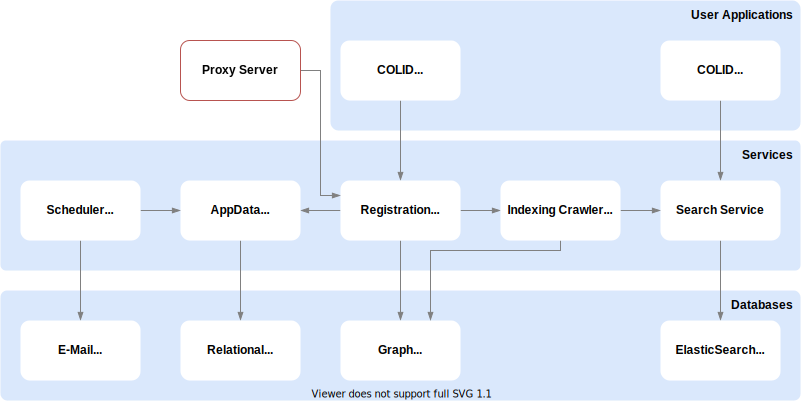

# Gabz toll

# Introduction

Corporate Linked Data - short: COLID - is a technical solution for corporate environments that provides a metadata repository for corporate assets based upon semantic models.
COLID assigns URIs as persistent and global unique identifiers to any resource.
The incorporated network proxy ensures that these URIs are resolvable and can be used to directly access those assets.
By following the Linked Data principles consequently, the data model of COLID uses RDF and provides the content through a SPARQL endpoint to consumers.
This model was developed based on learnings from open standards like dcat and prov-o.
Being both a management system for resolvable identifier and an asset catalog, COLID is the core service to realize Linked Data in corporate environments and therefore an essential cornerstone for FAIR data.

Corporate assets, or resources, can be manifold: data sets, ontologies, reference data, models, studies, or documents.
Each resource type has a set of metadata assigned, which may be optional or mandatory.
Metadata can be open content like plain or HTML formatted descriptive text, or closely defined, for example date/time, binary flags, or keywords using open and closed sets of controlled vocabularies.
Fields can be validated using SHACL constraints. 

Resources can have one or multiple Distribution Endpoints, which contain clickable links where users can directly access the resource or obtain further information about it.
Besides the link URI, Distribution Endpoints hold their own set of metadata, depending on the type of the endpoint.

Resources are often in specific relations to other resources.
In COLID such relations defined in the underlying semantic model and can be explicitly assigned as links between resources.
Linked resources are evaluated for search results scoring.

Adding or editing the metadata set of a resource type or distribution endpoint is only a matter of changing the ontology that defines it and does not require a code change in the software.

Functionality to read, maintain and administer COLID contents exists primarily in the backend as OpenAPI documented REST API endpoints.
To satisfy the ‘Findability’ requirements of FAIR, we employ a full text search engine.
Full text searching is augmented by search filters, that can be set for all metadata that hold a limited set of instances, for instance status values, contact persons or dates.
These filters are configured automatically based on the ontology describing the metadata per resource type.

At this time we offer two separate web clients for manual use of the software:
- COLID Editor gives access to all content editing and administrative functions. Users will only see functions according to their user privileges. 
- COLID Data Marketplace is for searching resources and information consumption.

COLID provides four levels of access to human users, using Active Directory security groups.
Every user can read all information.
Editor privilege is assigned for content that belongs to specific groups of users, typically representing business units.
Administrators can perform critical data tasks and have limited software configuration rights, while super administrators may change even most critical configurations.
For machine use we offer API to API access.

To provide some historic context, this project started already in early 2017 when [Gökhan Coskun](https://github.com/gcoskun) implemented a prototype to showcase the benefits of a flexible corporate asset register using URIs, based on a wiki tool.

In 2018 the program "Data as an Asset", as part of the global digitalization effort in Bayer, took shape.
We analyzed available data catalogs on the market and found none of them complying with our requirements of data centricity and FAIR and Linked data principles.
A decision was made to create what is COLID today. 

In mid 2018 Rolf Grigat was assigned as product owner, collected concrete requirements from the business units and started the implementation as a cloud native application with a bright and enthusiastic external development team, following agile development principles.
The software went fully operational in January 2019 and is meanwhile used across all Bayer divisions.
Rolf still leads the COLID DevOps team, with Gökhan still involved as scientific advisor.

## Architecture

The following architecture shows a high level overview of the architecture of COLID.
A more detailed view of each component can be found within the chapters of the application parts.
The interfaces to the application services, which are called by the two COLID clients and other external API services, are secured by the OAuth 2.0 Authorization Framework.
In the existing enterprise environment, AzureAD is used for the configuration.
Instructions for configuring access rights in AzureAD can be found in the chapter [Infrastructure > Security](infrastructure/security).

## COLID Editor client

Resources can be registered in the COLID Editor and enriched with predefined metadata. Among other metadata fields, the so-called PID URI (Permanent Identifier URI) is one of the most important. Each resource is assigned to one from the Registration Service, which is permanently retained throughout the life cycle of the resource. In addition, the actual resources, enriched with metadata in COLID, are linked via so-called Target URIs. These are entered manually by the user. The COLID Editor communicates with the Registration Service for resource registration.

## COLID Data Marketplace client

The COLID Data Marketplace allows the user to make the resources registered in the editor searchable with a full text search. In addition to the full-text search, the Data Marketplace also allows you to filter the resources according to individual attributes.

## Registration Service

The Registration Service is the core of the COLID application. The data-centric service receives the incoming information from the COLID Editor or other API application through a defined REST interface in JSON format, validates the incoming data against predefined metadata as well as SHACLs and finally stores the information as so-called "COLID entries" in the graph database in RDF format. The metadata and SHACLs are also available to the Registration Service in RDF format, which it makes available to users via the API.

## Proxy Server

The resources registered in the COLID Editor are assigned a PID URI by the Registration Service. However, the actual resources themselves are not stored in the COLID system, but are linked via Target URIs. The connection to the external resources and the necessary forwarding from the PID URI to the Target URI of each resource is done by the Proxy Server. The proxy server repeatedly pulls a new proxy configuration from the graph database via the Registration Service and thus establishes the connection of the permanent URI to the actual resource.

## Indexing Crawler Service

The Indexing Crawler Service (ICS) together with the Search Service is responsible for indexing COLID entries in the ElasticSearch search engine.
When a COLID entry is published by the Registration Service, the corresponding PID URI is sent to the ICS via a message queue. The ICS then retrieves the corresponding current entry from the graph database and sends it to the Search Service for indexing in the ElasticSearch search engine.

However, as the name of the service implies, it is also a crawler. With each new release, the ICS analyses the 
entry and searches for possible linked entries in the database. This is because the Data Marketplace also displays linked entries for each COLID entry. To ensure consistent data, these must also be re-indexed when an entry is added or updated. The ICS automatically ensures that all entries, including their links, are always updated and indexed in the Data Marketplace.

If the metadata on which all COLID entries are based is changed, individual or even all COLID entries may have to be adjusted. Since the ElasticSearch index is also based on this metadata, the index must be updated whenever this metadata changes. 
The Registration Service triggers the ICS via an HTTP request to initiate a reindex. The ICS retrieves the new, current metadata from the database and sends it by HTTP request to 
Search Service. A new index is created with the new metadata. If this index is successfully created, the ICS sends all PID URIs of the new entries to be indexed to the message queue. 
Step by step, the ICS processes this message queue and in doing so processes the individual PID URIs. Since this is a complete reindex and all entries are published, the ICS does not further analyze the entries for linked COLID entries
and only updates the corresponding entry of the PID URI itself. 

## Search Service

The Search Service enables full-text search through the COLID entries based on ElasticSearch, a search engine based on Lucene. All COLID entries are loaded from the graph database into an ElasticSearch index during reindexing by the Indexing Crawler Service and prepared there for full-text search. The basic structure of the index is based on all metadata provided by the Registration Service and is built automatically during the indexing process. The Serch Service provides the data for the Data Marketplace via its REST interface.

## Scheduler Service

Users of COLID can be informed that COLID entries have changed. In addition, a user can automatically repeat a search in the Data Marketplace and be informed of changes in the search results. Users are informed via e-mail, which the Scheduler Service sends out to the users based on the messages generated.
The Scheduler Service also generates nightly statistics from the graph database and stores this data in a separate index in ElasticSearch.

## AppData Service

The AppData Service (ADS) is used to store all application relevant information. It is mainly used for REST-compliant processing of user-dependent information. Up to now, the following information can be stored and processed:
- Users
- consumer groups

An AWS AuroraDB configured on MySQL 5.7 is used as the central persistence layer. The application communicates via the entity framework Core 3 to encapsulate all relational operations. An in-memory SQLite database is used for local execution, whereas a local MySQL instance can also be configured for use.
