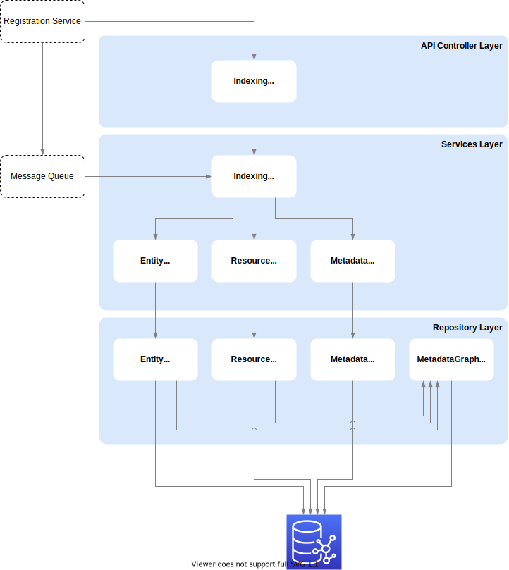

# Indexing Crawler Service

The Index Crawler Service (ICS) is responsible for indexing COLID entries in the ElasticSearch. If a COLID entry is published by the registration service, the corresponding pid uri is transferred to the ICS via the message queue. The ics fetch the corresponding current entry from the database. As the name of the service already suggests, it is a crawler. The ics analyzes the entry and search for possible linked entries. Because the data market place also displays linked entries for each entry, these must also be re-indexed to ensure consistent data. Thus, ics ensures that all entries, including their links, are updated and indexed.

When changing the metadata, there can be changes to single or all COLID entries. Since the index of the elasticsearch is based on this metadata, the index has to be updated if this metadata is changed. The registration service triggers the ics via an http request to start a reindex. The ics retrieves the new current metadata from the database and sends this via http request to the Data Marketplace service. A new index is created using the new metadata. If this index was successfully created, a pod of the ics sends all new entries to be indexed to the message queue. All available pods will then start to process the individual pid uris from the message queue. Because it is a reindex and all entries are published, the ics does not analyze the entries and only updates the corresponding entry of the pid uri.

## Technology Stack

1. ASP.NET Core 3.1
1. Docker image for deployment

### Special libraries

- [dotNetRDF](https://github.com/dotnetrdf)

## Application Architecture

## Communication

- Gets called by Registration Service via REST-API to create new index
- Calls REST-API of Search Service to create new index
- Pulls data from Message Queue from Registration Service and itself to get published COLID entries to reindex them
- Pushes data to Message Queue for Search Service and to index COLID entries
- Interacts with Graph Database via SPARQL HTTP-interface to READ ONLY COLID entries

# Sequence Diagram

The following diagram shows how the indexing of entries between the index crawler service, COLID Registration Service and data market place behaves and proceeds.

<!---
- *MESSAGE*: Reindex Start with Metadata (COLID -> Data Marketplace)
- Create new Index for Metadata (with Settings)
- Create new Index for Resource (with Settings)
- Update Metadata Update Alias (MUA)
- Update Resource Update Alias (RUA)
- Create Mapping from Metadata
- Set Metadata Mapping to RUA
- Put Metadata to MUA
- *MESSAGE*: Reindex Create SUCCESS (Data Marketplace -> COLID)
- *MESSAGE*: New Resource
- PUT Resource on RRA
- Update Metadata Search Alias (MSA)
- Update Resource Search Alias (RSA)
-->