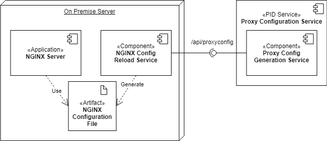
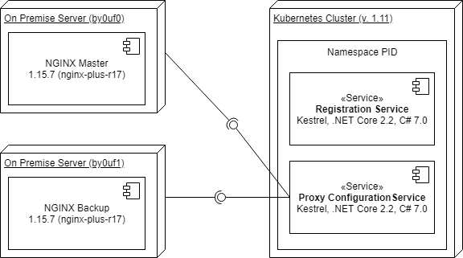

# NGINX

In COLID there exist two types of URIs. PID URIs are unique, permanent identifier of a registered resource, Base URIs can be identical in one version chain, otherwise they are unique. 
A high available on premise server running NGINX is used in the system to forward the in COLID generated PID URIs to a registered COLID entry and to Target URIs entered in COLID.

The fundamental idea behind COLID is registering external resources in so called COLID entries, generating unique, permanent URIs for these (see chapter how resources are registered), and forward these URIs.
Basically, a distinction must be made between PID URIs and base uris. PID URIs are unique. Base uris can be identical in one version chain, otherwise they are unique. Both are forwarded using some rules.

The forwarding of the URIs is done by an NGINX, running on an on premise server. NGINX uses a configuration file for all tuples of PID URI and Target URL.
This configuration is generated and provided by COLIDs Proxy Configuration Service on request (see chapter COLID internal architecture).

## Technology Stack

- NGINX web server (reverse proxy)
- systemd service
- systemd timer

## Application Architecture



## Communication

- Calls sequentially Registration Service to get latest NGINX configuration

## Special libraries

- None

## Forwarding Rules

- The PID URI of a COLID entry is always forwarded to the entry itself.
- If no distribution endpoint exists the base Uri redirected to the COLID entry. 

Distribution Endpoint:

- The PID URI of a distribution endpoint is forwarded to the target url of the endpoint.
- If the status of the endpoint is set to deprecated, the PID URI of the endpoint is forwarded to the PID URI of the COLID entry.

Main Distribution Endpoint:

- The PID URI of a distribution endpoint is forwarded to the target url of the endpoint.
- The base uri of the COLID entry is forwarded to the target url of the main distribution endpoint. If several versions of a COLID entry exist, the target url of the last main distribution endpoint from the versions chain is used to forward the base uri.

Additional rules, known as Extended URI templates (see chapter PID URI templates) allow COLID to control the behavior of forwarding for specific target systems.

## Design

The configuration for NGINX is pulled from the Registration Services instead of pushing new updates from the Registration Service to the running NGINX server.
For this a Bash script, running on an additional server, pulls the new proxy configuration every minute from Registration Service, generated by its Proxy Configuration Service.
The script validates the configuration with an onboard NGINX function and commands NGINX to reload the configuration. The timing of the script is controlled with a systemd Timer and Service.

The Proxy Configuration Service extracts all PID URIs and corresponding Target URLs from the graph database, and generates for each of the tuples suitable NGINX location configurations as shown in section Data View.
The normal translation of PID URIs to a target URLs is extended by the "Extended URI" feature. Normally, it is just a mapping of one PID URI to another target URL, where the NGINX server rewrites the PID URI to the target URL. 
The extended URIs adapts this standard way by giving administrators the possibilities to change the behavior on how the rewriting in NGINX works. Administrators are allowed to defined rewrite rules for each URL in the "Extended URI Templates" section in the admin panel in COLID. This section is completely independent of the created consumer groups and other sections administrators can see.

In the "Extended URIs" section, the administrators of COLID can create new or update and delete old extended URIs definitions by entering the following information:

- **Name**: The name for the rule.
- **Target URI Match Regex:** The Regular Expression to match the Target URI.
- **PID URI Search Regex:** The Regular Expression to match the PID URI.
- **Replace String:** The resulting format to translate the PID URI to the target URI.
- **Order:** The order number of the template in the created NGINX configuration.

Administrators will be provided some variables for building the extended URI resolution, to give them some flexibility: {{encodedPidUri}}, {{targetUri}}. The variables will be filled from the COLID entry while generating the proxy configuration for the NGINX server in COLID.

### Data View

The NGINX configuration data, the COLID Proxy Configuration Service generates, looks like the following example. See 
[*Tutorial: Understanding NGINX Server location block selection algorithms*](https://www.digitalocean.com/community/tutorials/understanding-nginx-server-and-location-block-selection-algorithms) for more information

```
location /example/12345678-1234-1234-123456789012 {
		rewrite ^.* https://foo.bar/;
}

location /test/t00000001 {
    rewrite ^.* https://www.test.com/;
}
```

The following two examples extend this generated configuration data with Extended URI templates.
In the first example, NGINX redirects all queries the users enter in the browser starting with the URL `https://pid.bayer.com/test/` to the target `https://www.test.com/`, and appends the attached path and query parameters to the target URL.

| Description  | Input / Output | Set Where? |
| --- | --- | --- |
| PID URI Search Regex | `https://pid.bayer.com/test/(.*)` | Configured in Admin Section |
| Target URI Match Regex | `^https://www\.test\.com` | Configured in Admin Section |
| Replace String | `${targetUri}?id=$1` | Configured in Admin Section |
| *&darr;* | &darr; | &darr; |
| Test PID URI | `https://pid.bayer.com/test/123123-12312-12312-123123` | User enters in browser |
| Result Target URL | `https://www.test.com?id=123123-12312-12312-123123` | NGINX redirects to |

The second example is more complex. Whatever the URL is the users enter in the browser (starting with `https://pid.bayer.com/`), if the target URI matches to `https://test.example.com/` the NGINX server appends the entered URL encoded to the end of the target URL.

| Description   | Input / Output | Set Where? |
| --- | --- | --- |
| PID URI Search Regex | `https://pid.bayer.com/(.*)` | Configured in Admin Section |
| Target URI Match Regex | `^https://test.example.com/` | Configured in Admin Section |
| Replace String | `${targetUri}#{encodedPidUri}` | Configured in Admin Section |
| *&darr;* | &darr; | &darr; |
| Test PID URI | `https://pid.bayer.com/kos/k0000003/e12312321` | User enters in browser |
| Result Target URL | `https://test.example.com/edg/tbl/k0000001_v1.editor#https%3A%2F%2Fpid.bayer.com%2Fkos%2Fc123123123%2Fe112312321` | NGINX redirects to |

With the extended URI feature all standard PID URIs are extended with a standard case. Additionally, the examples will extend the previous configuration with some extra entries. The in the admin section given order defines the order in the configuration. The following example shows the extended URI configuration:

```
location /example/12345678-1234-1234-123456789012 {
		rewrite ^.* https://foo.bar/;
}

location /test/t00000001 {
    rewrite ^.* https://www.test.com/;
}

location ~ /example/12345678-1234-1234-123456789012(.*) {
    rewrite ^/example/12345678-1234-1234-123456789012(.*) https://foo.bar/$1;
}

location ~ /test/t00000001(.*) {
    rewrite ^/test/t00000001(.*) https://www.test.com/$1;
}

location ~ /test/(.*) {
    rewrite ^/test/(.*) https://www.test.com?id=$1;
}

location ~ /(.*) {
    rewrite ^/(.*) https://test.example.com/edg/tbl/k0000001_v1.editor#https%3A%2F%2Fpid.bayer.com%2F$1;
}
```

### Component View

#### Software Components

1. COLID Registration Service registers COLID entries with PID URIs, Base URIs and Target URLs
2. Systemd nginx proxy config timer starts systemd nginx proxy config service frequently in 1 minute intervals
3. Bash script starts reloading NGINX configuration
4. COLID Proxy Configuration Service gets tuples of PID URIs and Target URLs and generates configuration on request
5. Bash script saves the NGINX configuration and validates it
6. Bash script reloads NGINX without downtime
7. NGINX uses new configuration


#### Technical Components

- AWS Account with a Kubernetes cluster
- In COLID Namespace two web services are running
    - COLID Registration Service
    - COLID Proxy Configuration Service
- Two on premise servers are running, installed with NGINX and the Bash script
    - One master server
    - One hot standby server, taking over if master is down (checked with VRRP, see chapter High Availability of NGINX)

For more information see chapter High Availability of NGINX.



### Implementation details

The following algorithm describes the generation of the NGINX Config generation:
1. Lookup all published COLID entries and take all tuples of PID / Target URI
    1. Check if any `Target URI match regex` of any extended URI template matches the target URI of the COLID entry
    1. Check if the PID URI of t he COLID entry matches `PID URI search regex` of the extended URI template
    1. Order the results by the order number of the extended URI templates
2. Fill values for NGINX location and the rewrite rule, following the next two sub algorithms

#### Location filling algorithm

1. Fill location with `~ ^<PID URI>(.*)`$
2. `<PID URI>` is the path of PID URI in the COLID entry: https://pid.bayer.com **/abcd/1234**

- ~ indicates the start of a location containing RegEx
- ^ is the start of the RegEx, $ the end
- (.*) is the extendable part of t he PID URI

#### Rewrite Rule algorithm

Fill the rewrite rule as follows
1. Take Replacement String of selected extended URI template as base string
2. In this base string fill variable {targetUri} with Target URI of COLID entry tuple
3. Fill variable {encodedPidUri} with URL-encoded PID URI of COLID entry. If a prefix is used in the COLID URL for the corresponding environment, it will be removed - dev-pid.bayer.com / qa-pid.bayer.com -> pid.bayer.com

### Technical details

The NGINX server is setup with a high availability feature, realized with Virtual Router Redundancy Protocol (VRRP). Details of this setup can be found in chapter *COLID DESIGN high availability.*

### Configuration details

The systemd service starts the Bash script in an additional environment. This environment is executed as root user on the environment and needs settings to get through proxy servers. This configuration is saved in `reload_nginx.conf`.

## Extras
### NGINX Configuration robustness check and possible improvements

Since the entire NGINX configuration update depends on a simple bash script, this should be the first step towards improvement of robustness.

1. Instead of Bash script write a .NET console application with exception handling
2. Try to get a Cloud -> OnPremise update working
    a. Maybe a .NET service with an open socket connection to the AWS cloud could be an option
    b. Message Queue between AWS cloud and on premise?
3. Separate the NGINX configuration files in separate files per COLID entry, so that only one COLID entry is failing
4. Separate Extended URIs in separate files per Extended URI template, import these at the end
