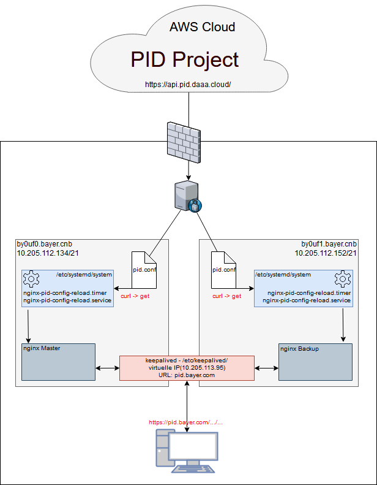
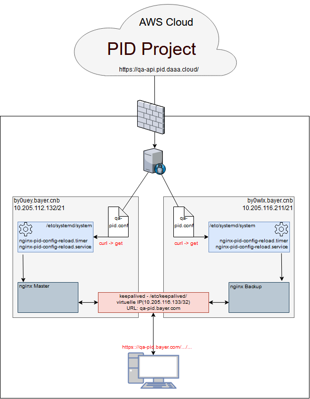

# High Availability of NGINX

## Overview

For the redirects created in the COLID project (system in the AWS Cloud), the pid.conf file is retrieved at a fixed interval via the provided API. The used nginx plus will be reloaded at the same time as the new configuration file.
Between the two nginx servers was set up an HA solution using the by nginx implemented keepalived. 
In event of a failure of the master node, the IP address is transferred to the backup node, thus ensuring fail-safety.
Further information can be found in the enclosed diagram and the scripts used.

## Systems in use

| System | IP / Mask | Environment | State |
| --- | --- | --- | --- |
| by0uf0.bayer.cnb | 10.205.112.134/21 | Production | NGINX Master |
| by0uf1.bayer.cnb | 10.205.112.152/21 | Production | NGINX Backup |
| by0uey.bayer.cnb | 10.205.112.132/21 | QA | NGINX Master |
| by0wlx.bayer.cnb | 10.205.116.211/21 | QA | NGINX Backup |

## Software in use

- OS: Red Hat Enterprise Linux Server 7.5
- Webserver: Nginx Plus 17.1
- IP Failover: keepalived 2.0.10 (nginx-ha)
- Other: Systemd Unit Files

## Production system



### Cluster IP

| IP | FQDN | Environment |
| --- | --- | --- |
| 10.205.113.95	| pid.bayer.com | Production |

### Software Versions

- OS: Red Hat Enterprise Linux Server release 7.5 (Maipo)
- Webserver: nginx-plus-17-1.el7_4.ngx.x86_64
- IP Failover: nginx-ha-keepalived-2.0.10-1.el7_4.ngx.x86_64

### Configuration Files

- */opt/pid/reload_nginx.conf*: Technical  user for Internet connection through Bayer proxy
- */opt/pid/reload_nginx_config.sh*: Script to load pid.conf from API
- */etc/nginx/conf.d/pid.conf*: Configuration file, which will be reloaded every min from API https://localhost:51770/api/v3/proxyconfig

- */etc/nginx/snippets/self-signed.conf*: SSL certificate configuration
- */etc/nginx/snippets/ssl-params.conf*: SLL parameters configuration

- */etc/systemd/system/nginx-pid-config-reload.service*: Systemd reload service
- */etc/systemd/system/nginx-pid-config-reload.timer*: Systemd reload timer

- */etc/keepalived/keepalived.conf*: HA Configuration Master Node
```
global_defs {
        vrrp_version 3
}
vrrp_script chk_manual_failover {
        script "/usr/libexec/keepalived/nginx-ha-manual-failover"
        interval 10
        weight 50
}
vrrp_script chk_nginx_service {
        script "/usr/libexec/keepalived/nginx-ha-check"
        interval 3
        weight 50
}
vrrp_instance VI_1 {
        interface eth0
        priority 101
        virtual_router_id 51
        advert_int 1
        accept
        garp_master_refresh 5
        garp_master_refresh_repeat 1
        unicast_src_ip 10.205.112.134
        unicast_peer {
                10.205.112.152
        }
        virtual_ipaddress {
                10.205.113.95
        }
        track_script {
                chk_nginx_service
                chk_manual_failover
        }
        notify "/usr/libexec/keepalived/nginx-ha-notify"
```
- */etc/keepalived/keepalived.conf*: HA Configuration Backup Node
```
global_defs {
        vrrp_version 3
}
vrrp_script chk_manual_failover {
        script "/usr/libexec/keepalived/nginx-ha-manual-failover"
        interval 10
        weight 50
}
vrrp_script chk_nginx_service {
        script "/usr/libexec/keepalived/nginx-ha-check"
        interval 3
        weight 50
}
vrrp_instance VI_1 {
        interface eth0
        priority 100
        virtual_router_id 51
        advert_int 1
        accept
        garp_master_refresh 5
        garp_master_refresh_repeat 1
        unicast_src_ip 10.205.112.152
        unicast_peer {
                10.205.112.134
        }
        virtual_ipaddress {
                10.205.113.95
        }
        track_script {
                chk_nginx_service
                chk_manual_failover
        }
        notify "/usr/libexec/keepalived/nginx-ha-notify"
```

## QA system


The QA System is configured identical to Production.

### Cluster IP

| IP | FQDN | Environment |
| --- | --- | --- |
| 10.205.116.133 | qa-pid.bayer.com | QA |

### Software Versions

- OS: Red Hat Enterprise Linux Server release 7.5 (Maipo)
- Webserver: nginx-plus-18-1.el7_4.ngx.x86_64
- IP Failover: nginx-ha-keepalived-2.0.14-1.el7_4.ngx.x86_64

### Configuration Files

- */opt/pid/reload_nginx.conf*: Technical  user for Internet connection through Bayer proxy
- */opt/pid/reload_nginx_config.sh*: Script to load pid.conf from API
- */etc/nginx/conf.d/pid.conf*: Configuration file, which will be reloaded every min from API https://localhost:51770/api/v3/proxyconfig

- */etc/nginx/snippets/self-signed.conf*: SSL certificate configuration
- */etc/nginx/snippets/ssl-params.conf*: SLL parameters configuration

- */etc/systemd/system/nginx-pid-config-reload.service*: Systemd reload service
- */etc/systemd/system/nginx-pid-config-reload.timer*: Systemd reload timer

- */etc/keepalived/keepalived.conf*: HA Configuration Master Node
```
global_defs {
        vrrp_version 3
}
vrrp_script chk_manual_failover {
        script "/usr/libexec/keepalived/nginx-ha-manual-failover"
        interval 10
        weight 50
}
vrrp_script chk_nginx_service {
        script "/usr/libexec/keepalived/nginx-ha-check"
        interval 3
        weight 50
}
vrrp_instance VI_1_QA {
        interface eth0
        priority 101
        virtual_router_id 53
        advert_int 1
        accept
        garp_master_refresh 5
        garp_master_refresh_repeat 1
        unicast_src_ip 10.205.112.132
        unicast_peer {
                10.205.16.211
        }
        virtual_ipaddress {
                10.205.116.133
        }
        track_script {
                chk_nginx_service
                chk_manual_failover
        }
        notify "/usr/libexec/keepalived/nginx-ha-notify"
```
- */etc/keepalived/keepalived.conf*: HA Configuration Backup Node
```
global_defs {
        vrrp_version 3
}
vrrp_script chk_manual_failover {
        script "/usr/libexec/keepalived/nginx-ha-manual-failover"
        interval 10
        weight 50
}
vrrp_script chk_nginx_service {
        script "/usr/libexec/keepalived/nginx-ha-check"
        interval 3
        weight 50
}
vrrp_instance VI_1_QA {
        interface eth0
        priority 100
        virtual_router_id 53
        advert_int 1
        accept
        garp_master_refresh 5
        garp_master_refresh_repeat 1
        unicast_src_ip 10.205.116.211
        unicast_peer {
                10.205.112.132
        }
        virtual_ipaddress {
                10.205.116.133
        }
        track_script {
                chk_nginx_service
                chk_manual_failover
        }
        notify "/usr/libexec/keepalived/nginx-ha-notify"
```