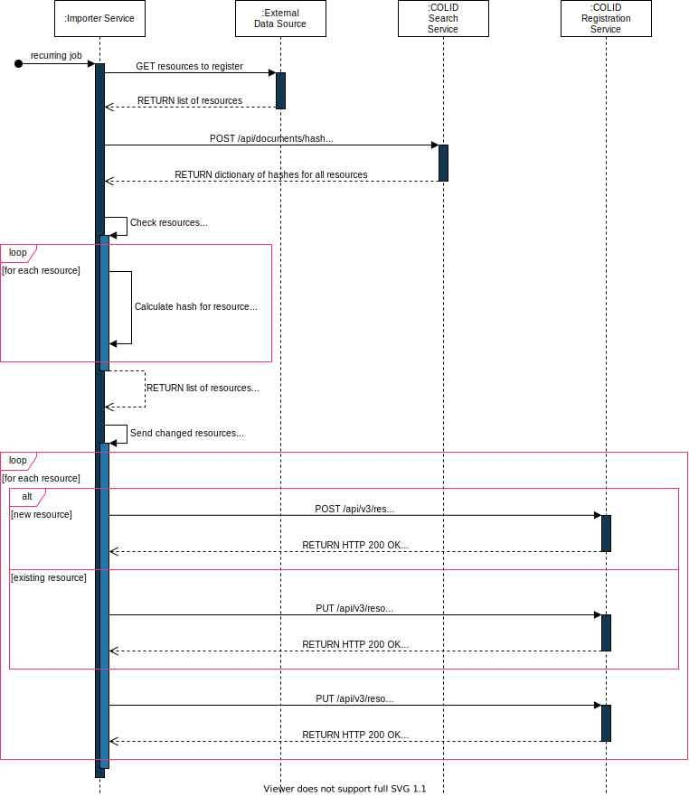

# Edit An Entry

Before a COLID entry draft will be published it can be edited as often as needed
This section explains how to edit a draft entry in COLID by using the API.

## API Usage

```shell
PUT "https://localhost:51770/api/v3/resource?pidUri=<...>" {...}
```

## Description

An entry can be edited by sending the whole request as like creating a new entry. The difference is that the PID URIs are known and not `null` anymore. Of course there are also the necessary changes the request is for.

As best practice it makes sense to request the current entry by using the `resource` interface in combination with the PID URI. The response can be modified to your needs and be used for editing the entry.

*Hint*:
If the entry is still a draft the editing process will overwrite the current draft.
If the entry is a published version yet, a new draft will be created or an existing one will be overwritten.

The following figure shows an example of how resources from third-party data sources can be registered in the COLID By using the endpoint to read hashes, the load on the COLID system can be further reduced.

