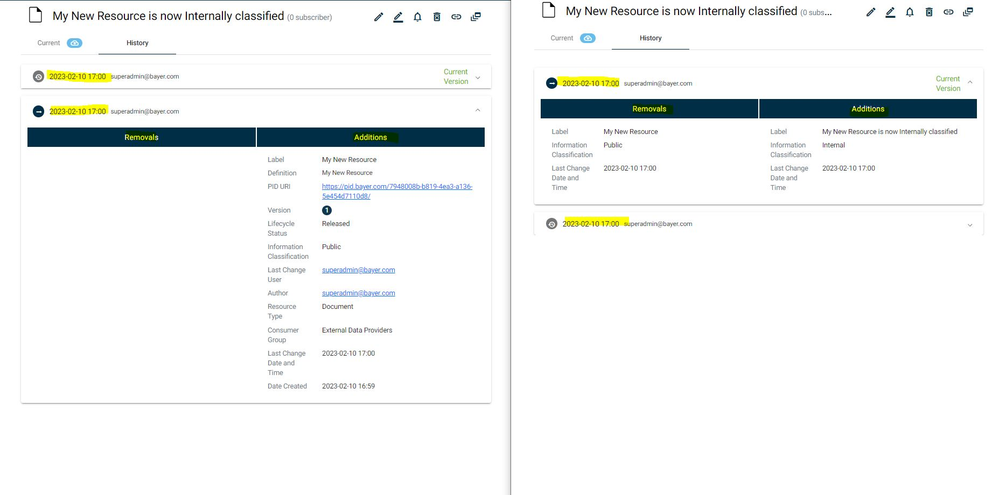

# Resource Version History

This section explains resource histories are saved in different version graphs

## Description

Users can browse through the publishing history of the resources to compare the content of the current published version with previous published versions.

Reasoning: Content publishers can choose to not use resource versioning to distinguish major changes to a resource. One reason can be that they want to keep the current URI or that the resource does not really support versioning. In that case metadata may change significantly over time, and users who have previously linked to a resource may find that the latest version is not what they saw when they linked to it. In that case it is important that they can find back the information that was valid at the time of linkage.

## Concept
The history is displayed as timeline, relative from the first publish date to the current version (including a current draft if available). Each version displays its own clickable marker. The changes between each version are stored as separate *Additions and Removals* graphs.

In the below example you can see that the left side illustrates the first version of the resource. At the creation a first *Addition* graph is created with the convention "UniqueIdentifier**Rev1_added**" ("https://pid.bayer.com/kos/19050#64748d99-f111-495d-8205-85e5bf78ca18Rev1_added"). Please note at the very first iteration there would be no removal graph.

The next image on the right illustrates the "Current Version" of the resource where the Label and the Information Classification Metadata had been changed.
These changes are saved in specific *Revision 2* additional and removals graphs respectively.

 

"https://pid.bayer.com/kos/19050#64748d99-f111-495d-8205-85e5bf78ca18Rev2_removed"
<pre>
Old Values for Information Classification and Label Removed 
https://pid.bayer.com/kos/19050#64748d99-f111-495d-8205-85e5bf78ca18
        https://pid.bayer.com/kos/19050/hasInformationClassification
                https://pid.bayer.com/kos/19050/<mark>Open</mark> ;
        https://pid.bayer.com/kos/19050/hasLabel
                <mark>"My New Resource" </mark>;
        https://pid.bayer.com/kos/19050/lastChangeDateTime
                "2023-02-10T16:00:09.878Z".

</pre>
"https://pid.bayer.com/kos/19050#64748d99-f111-495d-8205-85e5bf78ca18Rev2_added"
<pre>
New Values for Information Classification and Label Added  
https://pid.bayer.com/kos/19050#64748d99-f111-495d-8205-85e5bf78ca18
        https://pid.bayer.com/kos/19050/hasInformationClassification
                https://pid.bayer.com/kos/19050/<mark>Internal</mark> ;
        https://pid.bayer.com/kos/19050/hasLabel
                <mark> "My New Resource is now Internally classified" </mark>;
        https://pid.bayer.com/kos/19050/lastChangeDateTime
                "2023-02-10T16:00:38.878Z".

</pre>

When a resource is deleted, all its history is deleted as well.

