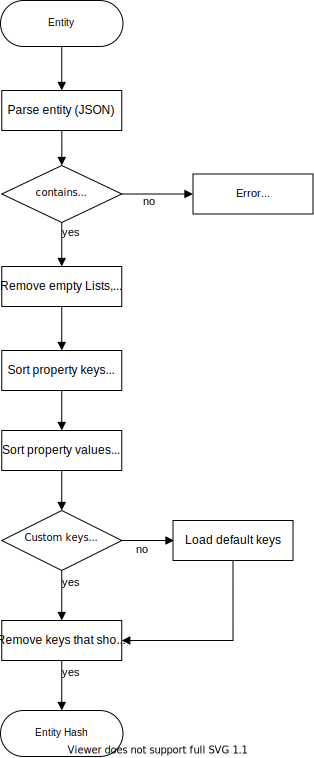
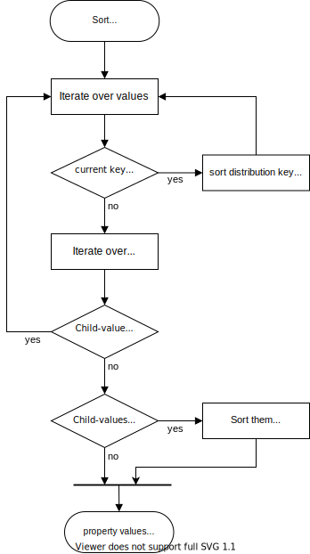

# COLID Entry Comparison

COLID can compare two entries based on their entered values. The metadata properties of both resources are combined and the values for each property are compared. Note that not only one value can be contained per property, but that some properties can also contain several values. Thus, the comparison must be made between all values of a single property.

## Input

* 2 internal identifiers

## Input Validation 

* If Internal Identifiers are equal: 400 Bad request (since it is an illogical behavior)
* If one of the resources could not be found: 404 NotFound

## Process

1. Get both resources from the database (note constraints below) 
1. Get both metadata based on the resource types and the Metadata Graph Configurations (MGC) linked by the resources. Note: If MGC and Resource Type are the same, they only need to be fetched once. 
    1. If the key of the metadata property is equally, but some constraints are different, the metadata property of the latest MGC is used.
1. Combine and sort both lists of metadata into one list (distinct by key). Order the new list by group id and order number
1. Iterate across all metadata, read from both resources the values matching the current MetadataProperty. Compare the values:
    1. Compare literals directly as value (1:1 comparison). Everything except strings are either unequal or equal (similarity 0 or 1)
    1. Compare all identifier (PID URIs, Base URIs) by their id (1:1 comparison)
    1. Compare links (consumer groups, links to other resources) with their id (1:1 comparison)
    1. Compare nested elements (distribution endpoints)  (n:m comparison)
        1. Search for same PID URI
        1. If found, compare the properties like normal resources (Iterate over all metadata)
        1. If not found, use comparison algorithm for multi field compare
    1. As for nested elements, if a field has more then one value (competency questions, data stewards, ...), use comparison algorithm for multi field compare (n:m comparison)

## Implementation Details

* Comparison Algorithms: https://itnext.io/string-similarity-the-basic-know-your-algorithms-guide-3de3d7346227
* Use Levenshtein Distance

* For each literal type (xsd:string, xsd:decimal, xsd:boolean, ...) different comparer are used to compare the values. These comparer MUST to return a similarity value between 0 and 1

## Constraints

* Distribution endpoints MUST be searched, a deep comparison must be applied 
* Linked versions of the resource are not checked (MUST be skipped)
* Other linked resources are not checked, but the outgoing links are checked by their IRI (id).
* Incoming links are not checked

## Output

The algorithm and API endpoint returns a DTO for the comparison, which contains the following fields:
```
ResourceComparisonDto
    + String firstResourceIds
    + String secondResourceIds
    + IList<MetadataProperty> CombinedMetadata
    + IDictionary<string, ResourceComparisonPropertyDto> CombinedProperties    // key equals id of metadata property
    + double similarity: Range(0,1)
```

```
ResourceComparisonPropertyDto
    + List<dynamic> firstProperties
    + List<dynamic> secondProperties
    + double similarity: Range(0,1)
```

## COLID Entity Hasher

The COLID Entity Hasher calculated a SHA256-hash based on the given entity and returns it. On top level, only properties will be used and these will be sorted by key first, then by it's value.

In detail, many steps are required and this function also prepares the given entity, which performs various necessary operations to create a normalized entity. The steps include:
- Load the entity
- Remove all empty values (null values, empty strings "" and empty lists)
- Sort all properties by top level keys
- Sort all properties by Values at the top level. If it is a value which has an entity, previous steps are recursive.
- Remove id-fields from distribution, main-distribution and attachments
- Remove all given property keys to be ignored
- Creation of the hash value (hex digest)

The removal of technical and invisibe technical keys will includes the following ones, if no custom keys are given:
- https://pid.bayer.com/kos/19050/hasHistoricVersion
- https://pid.bayer.com/kos/19050/646465
- https://pid.bayer.com/kos/19050/hasEntryLifecycleStatus
- https://pid.bayer.com/kos/19050/hasLaterVersion
- https://pid.bayer.com/kos/19050/lastChangeUser
- https://pid.bayer.com/kos/19050/546454
- https://pid.bayer.com/kos/19050/author
- https://pid.bayer.com/kos/19050/lastChangeDateTime
- https://pid.bayer.com/kos/19050/dateCreate

A detailed view / operation workflow is displayed in the flow chart below.

### Entity hashing workflow



### Entity hashing property value sorting workflow

The value sorting include additional/recursive steps in case that the value is an entity. This process will be shown below.
