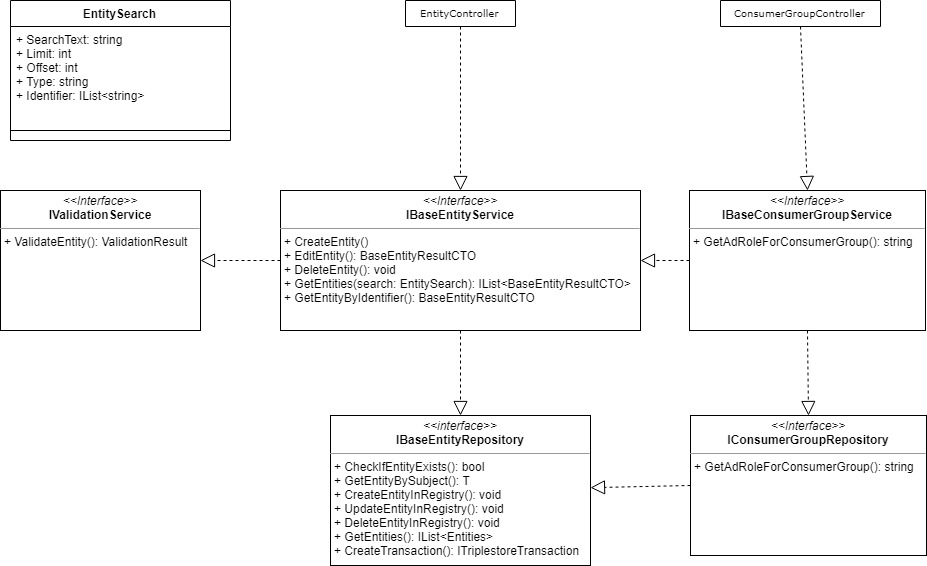

# Asynchronous loading of controlled vocabulary

Controlled vocabulary are asyncrhonously loaded and can be instances or taxonomies and are used in COLID as a selection of certain values. 
The idea behind controlled vocabulary is to give the user a selection of predefined values when entering different properties. In ontology, these are stored as instances of a class or taxonomy. The metadata describes the structure of an entry in COLID, so that the properties and their values are defined by the metadata. Accordingly, the user should be given the opportunity to read out these predefined values. 

Since the metadata already contains a lot of information, the predefined values shouldn't be part of the metadata and loaded asynchronously. By combining different values in the metadata, it can be decided whether one of the properties is the field which is defined by controlled vocabulary and therefore an asynchronous load is necessary (see chapter Data View). The COLID Registration Service already provides an interface that returns a list of these values. Since these are in turn entities, the result is a list of entities.

If a property is a Controlled Vocabulary, the list of possible defined values can be queried through the interface of the EntityController. Possible query parameters are the following:

* Type of entities (mandatory)
* Limit (mandatory)
* Offset (mandatory)
* SearchText
* List of identifiers

While the type, limit and offset are mandatory, all other parameters are optional. The limit specifies how many elements are to be returned. The offset determines where the list is started and the entities are returned. The SearchText searches the following properties for possible hits:

* rdfs:label

The list of identifiers adds already defined entities to the search, which are already known and therefore the values of the properties are important. 

To display an entity in the user interface, the entities are already loaded asynchronously while the display component is building up. Since the information of the resource is already available, the resource is already displayed to the user. Only the properties that contain controlled vocabulary are hidden and the user is notified by a spinner that data is being reloaded. This does not prevent that when an error occurs during the reloading of the Controlled Vocabulary, the resource with dedicated information can be displayed. 

In edit mode, the asynchronous reload is represented by a multi select component. When the component is initialized, the first 10 entries are loaded. If the user scrolls towards the end of the list, the next 10 entries are queried again. If a search is triggered by the user by entering a search text in the input field, all already loaded entries are discarded and a new list is requested. This avoids the risk that the client needs too many resources to work with the UI. 

## Data View

### Request

``` curl
curl -X GET \
  http:///metadata/entities \
  -H 'Content-Type: application/json' \
  -d '{
	"SearchText": "",
	"Limit": "",
	"Offset": "",
	"Type": "",
	"Identifier": [
		"",
		""
		]
}'
```

### Response 

```json
[
    {
    "id": "https://pid.bayer.com/kos/19050/Internal",
    "properties": [
        {
            "key":"http://www.w3.org/2000/01/rdf-schema#type",
            "value":"https://pid.bayer.com/kos/19050/InformationClassification"
        },
        {
            "key":"http://www.w3.org/2000/01/rdf-schema#label",
            "value":"Internal"
        }
    ]
    },
    {
    "id": "https://pid.bayer.com/kos/19050/Secret",
    "properties": [
        {
            "key":"http://www.w3.org/2000/01/rdf-schema#type",
            "value":"https://pid.bayer.com/kos/19050/InformationClassification"
        },
        {
            "key":"http://www.w3.org/2000/01/rdf-schema#label",
            "value":"Secret"
        }
    ]
    }
]
```

### SPARQL
The SPARQL query, which fetches the corresponding entities from the database, looks like this. If no search text is specified, the filter condition is omitted. Offset is intial 0 and limit = 100.

``` sparql
SELECT DISTINCT *
FROM <https://pid.bayer.com/graph/pid_metadata/1.0>
FROM <https://pid.bayer.com/graph/pid_technical/1.0>
FROM <https://pid.bayer.com/graph/pid_metadata_shacl/1.0>
FROM <https://pid.bayer.com/graph/eco/1.0>
FROM <https://pid.bayer.com/graph/consumergroup/v4>
WHERE
{
    {
    Select ?s 
    where { 
        ?s a <https://pid.bayer.com/kos/19050#ConsumerGroup>. 
        optional { ?s rdfs:label ?label }
        filter(regex(str(?label), "searchText" ))
        }
    ORDER BY ?label
    Offset 0
    Limit 100
    } 
    UNION 
    { 
        ?s a <https://pid.bayer.com/kos/19050#ConsumerGroup>. 
        FILTER(?s in (<https://pid.bayer.com/kos/19050#82fc2870-ca4e-407f-a197-bf3766ad785f>)) 
    }
    ?s ?p ?o
}
```

## Component View



## Adaptation of existing code
### Registration Service

#### ResourcePreprocessService/ValidateAndOverwriteProperties

Since there is no cv at this point, it must be reloaded by the developer. Alternatively, the shacl validator must be adapted and the respective instances must be sent within the data shapes. 

``` c#
if (metadataProperty != null && property.Key != Constants.Metadata.Type && metadataProperty.Properties.GetValueOrNull(Constants.Shacl.ControlledVocabulary) != null && metadataProperty.Properties.GetValueOrNull(Constants.Shacl.NodeKind) == Constants.Shacl.IRI && metadataProperty.GetMetadataPropertyGroup()?.Key != Constants.Resource.Group.LinkTypes)
{
    var cvProp = metadataProperty.Properties.GetValueOrNull(Constants.Shacl.ControlledVocabulary);
    List<KeyValuePair<string, string>> controlledVocabulary = cvProp.GetType() == typeof(JArray) ? cvProp.ToObject<List<KeyValuePair<string, string>>>() : cvProp;
    if (controlledVocabulary.All(cv => cv.Key != property.Value))
    {
        validationErrors.Add(new ValidationResultProperty(requestResource.Id, property.Key, $"Given string is not a controlled vocabulary: {property.Value}", true));
    }
}
```

#### MetadataRepository/GetMetadataForEntityType:

Remove following part from query:

``` sparql
UNION
{
    @entityType rdfs:subClassOf*  ?resourceType.
    ?resourceType sh:property ?shaclConstraint.
    ?shaclConstraint ?shaclProperty ?shaclValue.
    ?shaclValue rdfs:range ?cvRange.
    ?cv rdf:type ?cvRange.
    ?cv rdfs:label ?cvLabel
}                    
```

#### MetadataRepository/CreateMetadataPropertyFromList:

Adapt switch case to:

``` c#
case Constants.Shacl.Path:
    if (shaclValue == Constants.Metadata.HasVersion)
    {
        facetOnlySearch = true;
    }

    if (shaclValue == Constants.Metadata.PidUri || shaclValue == Constants.Metadata.BaseUri || shaclValue == Constants.Metadata.HasEntryLifecycleStatus)
    {
        facetExclude = true;
    }
break;
```
