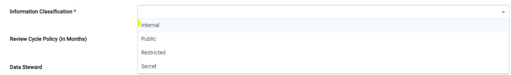

# Resource Metadata, SHACL and Instances Graphs

## Resource Metadata
In the previous section we understood how to define and create resource type class.
In this section we shall continue to understand how the metadata of each resource is defined and validated. The validation of every metadata is done as per Shapes Constraint Language (SHACL) mentioned earlier. Thus it is important that one has a good understanding of the SHACL concepts and vocabulary mentioned in the [earlier sections](./../ontology.md).

Metadata of resource is defined as a *shacl property shape*. A property shape is a shape in the shapes graph that is the subject of a triple that has *sh:path* as its predicate. We use this *sh:path* field to store the actual metadata into the named graph.

Let's define two basic properties which is needed for every resource. We shall use the Generic Dataset resource mentioned in previous section an example. Every COLID resource must have:
- Label - Title for the registered resource.
- PID URI - The Unique permanent identifier for every resource.
- Information Classification - Information classification level for every resource, example - public, secret etc.

<pre>
  https://pid.bayer.com/kos/19050/GenericDataset
  a owl:Class ;
  a sh:NodeShape ;
  dash:abstract false ;
  rdfs:comment "Any dataset that is not an RDF dataset, nor one of the more specific types of non-RDF datasets. It can be a file like xml, xls, csv or data stored in systems like sql, MongoDB, Neo4J etc." ;
  rdfs:label "Generic Dataset"@en ;
  rdfs:subClassOf https://pid.bayer.com/kos/19050/NonRDFDataset  .
  sh:property https://pid.bayer.com/kos/19050/Label ;<mark>shacl property for defining resource Label</mark>
  sh:property https://pid.bayer.com/kos/19050/PIDURI .<mark>shacl property for resource PID URI</mark>
  sh:property https://pid.bayer.com/kos/19050/InformationClassification .<mark>shacl property for information classification</mark>
</pre>

## SHACL Validation
After defining shacl properties (*sh:property*) for resource metadata, these property shapes can be created to validate the quality and integrity of the data

- Label
  - must be mandatory and unique
  - must be a RDF Literal (Literals are used for values such as strings, numbers, and dates)

<pre>
  https://pid.bayer.com/kos/19050/Label
  a sh:PropertyShape ;
  sh:path https://pid.bayer.com/kos/19050/hasLabel ; <mark>this path will be used to save the label in database (named graph)</mark>
  sh:datatype xsd:string ;
  sh:description "This is the label for this registered resource (e.g. title/name for dataset, mathematical models, etc.)." ;
  sh:maxCount 1 ;<mark>mandatory value</mark>
  sh:minCount 1 ;<mark>unique value</mark>
  sh:name "Label"@en ;
  sh:nodeKind sh:Literal .<mark>stored in db as string</mark>
</pre>

- PID URI
  - must be mandatory and unique
  - must be an Unique IRI (for more information see [here](https://www.w3.org/TR/rdf11-concepts/#dfn-iri))

<pre>
  https://pid.bayer.com/kos/19050/PIDURI
  a sh:PropertyShape ;
  sh:path https://pid.bayer.com/kos/19050/hasPIDURI ; <mark>this path will be used to save the PID URI in database (named graph)</mark>
  sh:maxCount 1 ;<mark>mandatory value</mark>
  sh:minCount 1 ;<mark>unique value</mark>
  sh:name "PID URI"@en ;
  sh:nodeKind sh:IRI .<mark>stored in db as IRI</mark>
</pre>

## Instances
We saw above how each property of a resource is defined and saved in database. It may be possible that for certain IRIs, we have to provide users with a pick list filled with instances. 
For example COLID allows 4 Bayer Information Classification levels for any registered resource.

- For this we first define a class in the Ontology for the Information Classification Field.
- And then create instances "Internal, Public, Restricted and Secret" for this Class.

<pre>
  https://pid.bayer.com/kos/19050/InformationClassification
  a owl:Class ;
  rdfs:label "Information Classification"@en .

 <mark> class created to above and instances defined below. the URI of the instance will be saved as the value in the database. </mark>

  https://pid.bayer.com/kos/19050/Internal
  a https://pid.bayer.com/kos/19050/InformationClassification ;
  rdfs:label "Internal"@en ; .

  https://pid.bayer.com/kos/19050/Public
  a https://pid.bayer.com/kos/19050/InformationClassification ;
  rdfs:label "Public"@en ; .

    https://pid.bayer.com/kos/19050/Secret
  a https://pid.bayer.com/kos/19050/InformationClassification ;
  rdfs:label "Secret"@en ; .

    https://pid.bayer.com/kos/19050/Restricted
  a https://pid.bayer.com/kos/19050/InformationClassification ;
  rdfs:label "Restricted"@en ; .
</pre>

- Finally the created class is associated to the metadata property sh:path using *rdfs:range* and *sh:class*

<pre>
  https://pid.bayer.com/kos/19050/shacl-InformationClassification
  a sh:PropertyShape ;
  sh:path https://pid.bayer.com/kos/19050/hasInformationClassification ; 
  sh:maxCount 1 ;
  sh:minCount 1 ;
  sh:name "Information Classification"@en ;
  sh:nodeKind sh:IRI .
  sh:class https://pid.bayer.com/kos/19050/InformationClassification . <mark>information classification class from above</mark>

 sh:path property defined below which would save the value in database

https://pid.bayer.com/kos/19050/hasInformationClassification
  a owl:ObjectProperty ;
  rdfs:label "has information classification"@en ;
  rdfs:range https://pid.bayer.com/kos/19050/InformationClassification ; . <mark>information classification class from above</mark>

</pre>

## Instance Graphs

For certain fields there can be numerous values which need to be updated as per request dynamically. This can be defined using following:  
- shacl property at metadata level using *sh:fieldType* 
 
sh:fieldType sh:fieldType#extendableList .

- the .ttl graph file name should be then defined at the metadata class.
 
sh:instanceGraph https://pid.bayer.com/instances/myDatasetInstances .
 

  The name of the instance graph defined above (https://pid.bayer.com/instances/myDatasetInstances.ttl)  would be then synched at the metadata graph configuration which is elaborated in next section in detail. 