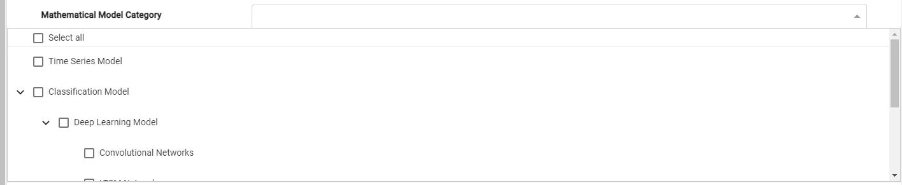

# Taxonomies in COLID

A taxonomy is a system of hierarchical types that can be used to describe entities. The types are expressed in a class and subclass system.
So for example, a basic taxonomy might consist of a class called "Mathematical Model" which might have subclasses "Time Series Model" and "Classification Model". Then, "Classification Model" might in turn have subclasses "Neural Networks" and "Convolutional Networks". This hierarchy means that a "Neural Networks" is a type of "Classification Model", and is also a type of "Mathematical Model".

The below image exhibits the same example of all available categories for the mathematical models. 

## Creating Taxonomy

Taxonomies should generally follow a logical hierarchical structure. The terms representing the broadest concepts should be at the top level, and terms representing more specific concepts within those concepts must be placed at a deeper level. This can be represented well by **SKOS** Simple Knowledge Organization System Primer broader and narrower terms - *skos:broader* and *skos:narrower*. 
- a broader term which is generic and a narrower term which is a more specific type of the generic broader term,
- a broader term which is generic and the narrower term is a named instance (proper noun) of the generic broader term,
- a broader term which is a whole entity and a narrower term which is an integral part.

<pre>
Mathematical Model Category Taxonomy
│  every broad/narrow concept must be an instance of the corresponding COLID metadata field.
│  rdf:type https://pid.bayer.com/kos/19050/MathematicalModelCategory 
└───Mathematical Model Category (Concept scheme for Mathematical Model Category)
│   └───Regression Model
│   └───Time Series Model 
│   └───Classification Model 
│       └───Deep Learning Model skos:narrower concepts below
│           │   Convolutional Networks skos:broader concept of Deep Learning Model
│           │   Neural Networks skos:broader concept of Deep Learning Model
│           │   LTSM Networks skos:broader concept of Deep Learning Model
│       
│   └───Clustering Model
└───...
</pre>

Thus COLID follows the standard semantics process for defining taxonomies. The only point to be noted is that every concept should in-turn be instantiated to the respective COLID Metadata field.

rdf:type https://pid.bayer.com/kos/19050/MathematicalModelCategory

Once the taxonomy .ttl file is generated it can be attached to the metadata configuration which is explained in the next section.
