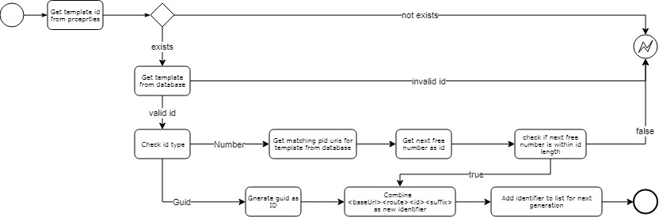

# PID URI Templates
PID URIs are unique, permanent identifier of a registrated resource (see Chapter xxx). PID URI templates are used to generate those identifiers.

The fundamental idea behind COLID is registering external resources in so called COLID entries, generating unique, permanent URIs for these in so calls identifier. PID URI Templates are defined and managed by admins so that identifiers are assigned to specific consumer groups (see chapter consumer groups). Users who belong to these groups can use the assigned templates when creating a COLID entry and have an identifier generated. In special, the same identifier structure should be used for different target systems, so that they are important (for more information see chapter PID URI forwarding).

In the admin area under "PID URI Templates" templates can be created, edited and deleted. The following information must be entered:
* Base Url: Host of COLID
* Route
* ID Type - Choice of GUID or Number
* ID Length - Defines the length of the ID type.
  * GUID always zero.
  * Number natural number
* Suffix - Choice of Empty or "/"

From the above information the template is put together as follows: 

`<baseUrl><Route><idType:idLength><suffix>`

If an entry is created in COLID, the user can select one of the predefined templates. The corresponding template is added to the identifier so that it can be made available to the user for further operations in the future. For example, if a new endpoint is created, the already used template of the PID URI of the entry is selected by default. So it is suggested to use the same templates for all properties of a resource or a new version. 

While saving an entry, the registration service checks whether a corresponding template has been selected. If a template exists, a special algorithm is used to generate the PID URIs (see chapter Implementation details).

If the user selects a template and additionally selects an individual PID URI (using Api), the system checks whether the PID URI matches the template. If this is not the case, the template is removed. 

## Data View

### Request
In the following a request of an identifier is shown, which is contained in a COLID entry when saving. Beside the type of the property a template is selected. It contains the corresponding ID of the template as value. Based on the ID the corresponding template is loaded from the database and an identifier is generated. 

```json
{
   "properties":[
      {
         "key":"http://pid.bayer.com/kos/19014/hasPID",
         "value":{
            "id":"",
            "properties":[
               {
                  "key":"http://www.w3.org/1999/02/22-rdf-syntax-ns#type",
                  "value":"https://pid.bayer.com/kos/19050/Identifier"
               },
               {
                  "key":"https://pid.bayer.com/kos/19050/hasUriTemplate",
                  "value":"https://pid.bayer.com/kos/19050#b2df6b6b-7e32-4d42-9404-69f51d554967"
               }
            ]
         }
      }
   ]
}
```
### Database

``` rdf
<https://pid.bayer.com/kos/19050#b2df6b6b-7e32-4d42-9404-69f51d554967>
	rdf:type	                                                <https://pid.bayer.com/kos/19050#PidUriTemplate> ;
	<https://pid.bayer.com/kos/19050#hasBaseUrl>	            "https://qa-pid.bayer.com/"^^xsd:string ;
	<https://pid.bayer.com/kos/19050#hasPidUriTemplateIdType>	<https://pid.bayer.com/kos/19050/taxonomies#Guid> ;
	<https://pid.bayer.com/kos/19050#hasPidUriTemplateSuffix>	<https://pid.bayer.com/kos/19050/taxonomies#Empty> ;
	<https://pid.bayer.com/kos/19050#hasRoute>	                "GeAR/"^^xsd:string .

<https://pid.bayer.com/kos/19050#5a9bc613-f948-4dd3-8cd7-9a4465319d24>
	rdf:type	                                                <https://pid.bayer.com/kos/19050#PidUriTemplate> ;
	<https://pid.bayer.com/kos/19050#hasBaseUrl>	            "https://qa-pid.bayer.com/"^^xsd:string ;
	<https://pid.bayer.com/kos/19050#hasIdLength>	            "7"^^xsd:string ;
	<https://pid.bayer.com/kos/19050#hasPidUriTemplateIdType>	<https://pid.bayer.com/kos/19050/taxonomies#Number> ;
	<https://pid.bayer.com/kos/19050#hasPidUriTemplateSuffix>	<https://pid.bayer.com/kos/19050/taxonomies#Empty> ;
	<https://pid.bayer.com/kos/19050#hasRoute>	                "kos/k"^^xsd:string .
```

## Generation algorithm


