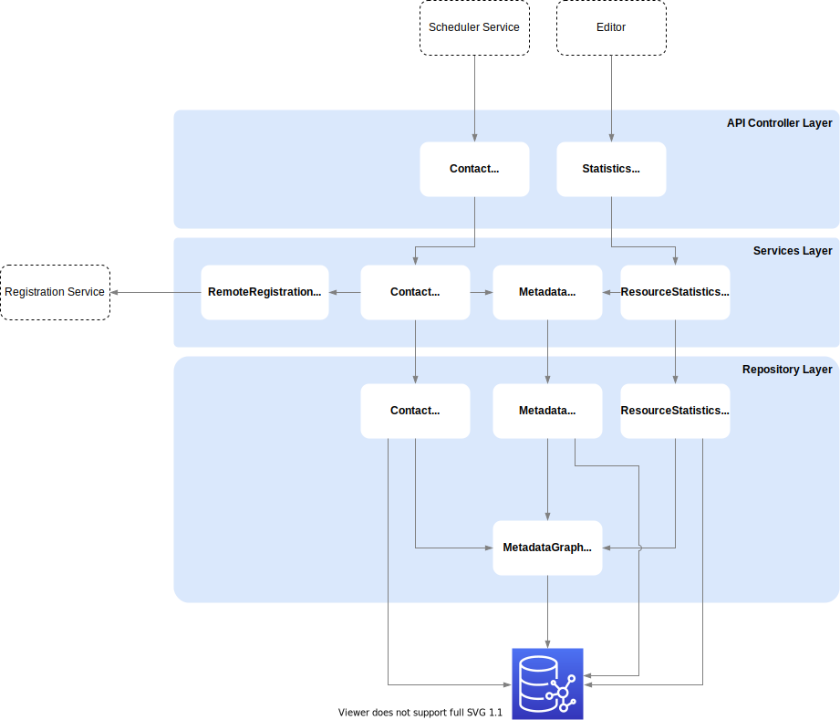

# Reporting Service

This design document will give an overview which architecture the reporting service is based on and how it is integrated into the COlID infrastructure. The reporting service has the purpose of providing reports related to registered data from COLID, such as the number of all entries registered in COLID. The goal of this service is to provide information that on the one hand gives the business side exclusion about registered entries and their properties, and on the other hand provides the basis for functionalities of other services, such as which persons are referenced in the system and which are not. 

## Technology Stack

1. ASP.NET Core 3.1
1. Docker image for deployment

### Special libraries

- [dotNetRDF](https://github.com/dotnetrdf)

## Application Architecture

## Communication

- Gets called by COLID Editor while fetching statistics
- Get sequentially called by Scheduler Service from running background jobs
- Interacts with Graph Database via SPARQL HTTP-interface for CRUD actions of entities
