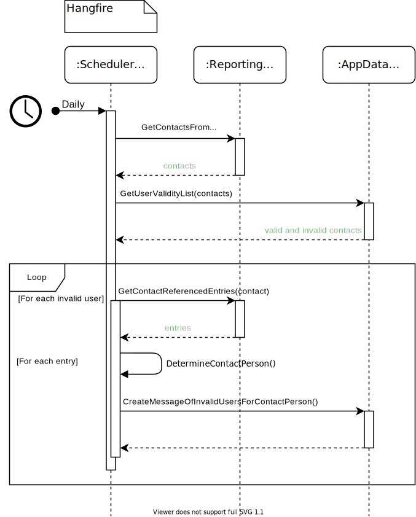

# Data Quality

In the following, the different methods for maintaining and improving data quality are described.

## User validity check

With the *User validity check* all users assigned to the different COLID entries are checked daily for validity. A user is considered invalid if it is marked as inactive in the Active Directory. The same applies to users that are not found in the Active Directory. A distinction is made between the following types of users:

- Author
- Last Changed User
- Change Requester
- Data Steward
- Contact Person (of a Distribution Endpoint)

To fulfill this task, the Scheduler Service works together with the Reporting Service and the AppData Service. The exact sequence is shown in the following sequence diagram

