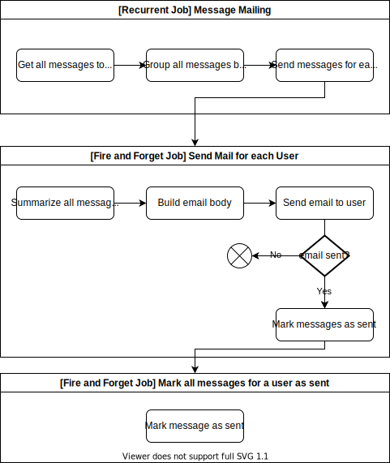

# Message Mailing

In general messages will be send per mail to the user as long the user did not 'read' the message in COLID Editor. If there are more than one message for a user, all messages will
be appended to on larger mail which will be send instead of sending several messages per mail.

The point in time where messages are send by mail depends on the user specific configuration where an intervall (weekly, montly, etc.) can be choosen.

The following graphic depicts the workflow for message handling and how the scheduler service is involved here. It does only cover the main aspects and not every detail. Please be
aware that 3a and 3b are mutually exclusive.

## Hangfire implementation details

