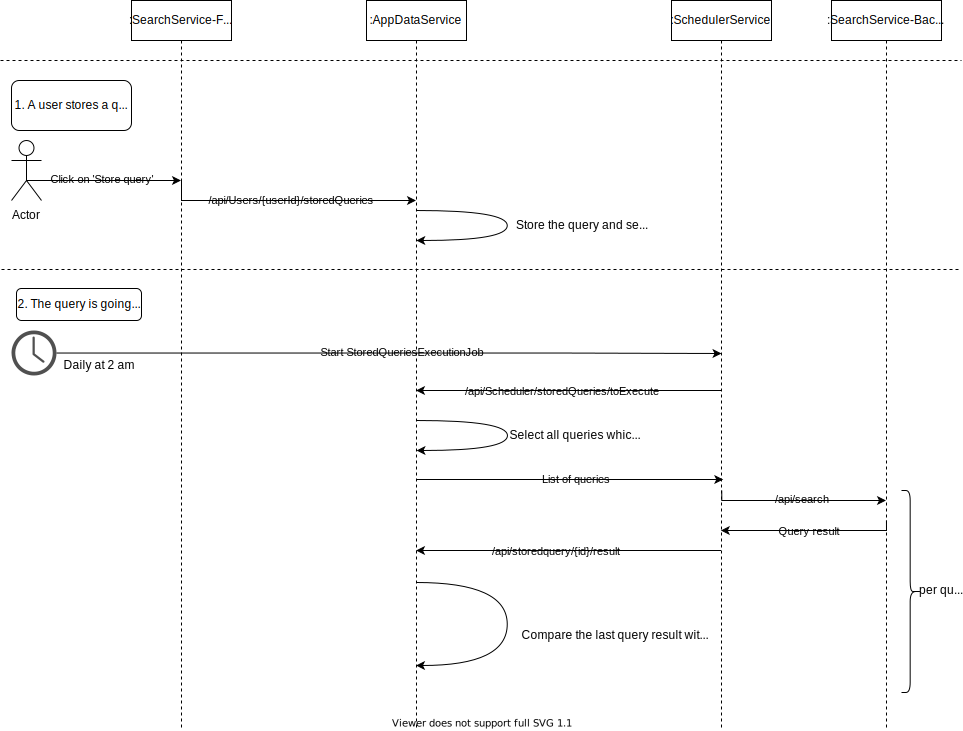

### Stored query execution workflow

The user is able to store search queries from the SearchService and let them execute regularly in an interval (weekly, monthly, etc.). If there´s a difference to an earlier executed search query, a message will be created for that user about that fact.

The following graphic depicts the workflow for executing stored queries and how the scheduler service is involved here. It does only cover the main aspects and not every detail.

