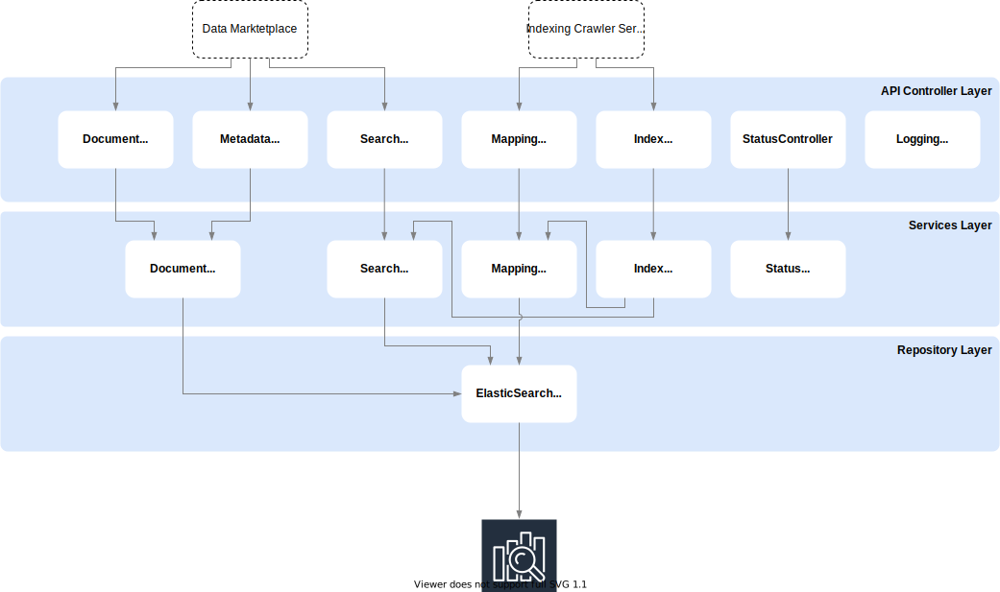

# Search Service

The Search Service enables full-text search through the COLID entries based on ElasticSearch, a search engine based on Lucene. All COLID entries are loaded from the graph database into an ElasticSearch index during reindexing by the Indexing Crawler Service and prepared there for full-text search. The basic structure of the index is based on all metadata provided by the Registration Service and is built automatically during the indexing process. The Serch Service provides the data for the Data Marketplace via its REST interface.

## Technology Stack

1. ASP.NET Core 3.1
1. RabbitMQ.Client
1. Elasticsearch.Net with NEST API
1. Docker image for deployment

### Special libraries

- [NEST](https://www.elastic.co/guide/en/elasticsearch/client/net-api/current/nest.html)
- [RabbitMQ](https://www.rabbitmq.com/)

## Application Architecture

## Communication

- Gets called by Indexing Crawler Service via REST-API to create new index
- Pulls data from Message Queue from Indexing Crawler Service to get published COLID entries to index them
- Interacts with ElasticSearch via NEST API

## Data Model

- Index Mapping based on Metadata

<!---
- *MESSAGE*: Reindex Start with Metadata (COLID -> Data Marketplace)
- Create new Index for Metadata (with Settings)
- Create new Index for Resource (with Settings)
- Update Metadata Update Alias (MUA)
- Update Resource Update Alias (RUA)
- Create Mapping from Metadata
- Set Metadata Mapping to RUA
- Put Metadata to MUA
- *MESSAGE*: Reindex Create SUCCESS (Data Marketplace -> COLID)
- *MESSAGE*: New Resource
- PUT Resource on RRA
- Update Metadata Search Alias (MSA)
- Update Resource Search Alias (RSA)
-->