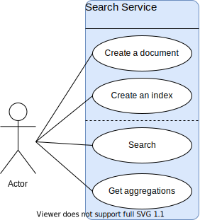

# API

This section provides an overview on how to use the API of the COLID search service.

The following use cases are described here as high-level step-by-step examples:

The API is available for testing and productive usage:

+ Local:  [https://localhost:51801/api](https://localhost:51801/api)
+ Docker: [https://localhost:51800/api](https://localhost:51800/api)

There is also a documentation of the whole API available:

+ Local:  [https://localhost:51801/swagger/index.html](https://localhost:51801/swagger/index.html)
+ Docker: [https://localhost:51800/swagger/index.html](https://localhost:51800/swagger/index.html)

Before the API can be used by another application, the application must be registered <u>separately</u> in Azure AD.

Please be aware that there might be further versions of the API whereby older versions will become deprecated. Information about the supported but also deprecated versions will be returned by the API in the response headers.

