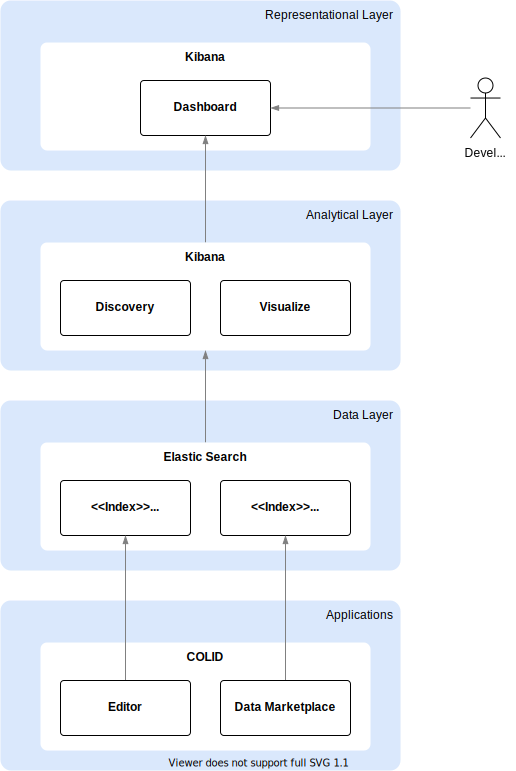

# Application Insights

This chapter gives an overview of how valuable application insights are created, stored and provided to the users.
- How many users do we have for COLID and Data Marketplace?
- Which are the most popular searches in Data Marketplace?
- How many resources are existing?

Storing and analyzing of the relevant data will help to gain powerful insights into how people uses the applications. Every time the application is updated, it can be assessed how well it works for the users. With this knowledge, data driven decisions about the next deployment cycles can be made.

## Design

In the center of every analytical solution is the data. Without data it is not possible to find any insights and to run any analytical solution. So first the provision of the data has to be ensured. The next step is to provide a toolset to explore and analyze the data. Results of the analysis have to be visualized appropriate and in an easy way to be consumed by the users. 

To provide such an analytical solution for applications insights the ELK stack is used. The ELK stack is a collection of the open-source products Elasticsearch, Logtash and Kibana. In this solution Elasticsearch and Kibana will be used only. The ELK stack is the most popular log management platform. 

The solution exists of several components which can be assigned to three different layers which is shown in the figure below. Below each of the layers with the main functionalities will be described starting from the bottom.

### Data Layer

The heart of every analytical application is the data. Therefore it has to be ensured that the connections for the needed source systems are established. In this solution two source applications are used, COLID and Data Marketplace. As centralized storage of the application logs Elasticsearch is used. The data of each application is stored in a dedicated index. 

### Analytical Layer

The analytical layer provides a toolset to explore and analyze the available data in Elasticsearch. Kibana provides different tools for this purposes and works on top of Elasticsearch.

### Representational Layer

This layer serves as user interface to act with the data. Insights can be easily consumed in flexible and intuitive dashboards in Kibana.

## Data View

Data will be stored in Elasticsearch. Elasticsearch supports documents in JSON format and uses the NoSQL philosophy for document storage. This has the advantage of allowing a flexible schema for the data. Data from multiple data sources can be stored in the centralized data store on Elasticsearch.

For each application a dedicated index with an unique name will be created. Dynamic mapping is used for the indices which allows flexible data structures. Data structure will be defined by the data producer. 

Data which will be stored are mainly log events of an application. Each log event will be stored as a document in the index. To enable analysis on the log events, each document should contain some standard fields like below:

- Timestamp
- UserID
- Layer
- LogLevel
- Message

## Component View
Each layer serves a special purpose and consists of several components. Further details and dependencies are described in the following. Beginning with the lowest layer in the figure above.

### Data Layer

For each application an index with an unique name has to be created. This index has to be filled with data from the associated application. 

As standard solution for writing data to an index a logging service will be used. This logging service has to be integrated in the application which should be monitored.  Relevant log events, which should be stored in the index, has to be identified by individual applications. 

### Analytical Layer

For analysis of the data Kibana is used. Kibana can be divided into two components in this layer:

- **Discover**

  In Discover, every document in every index can be accessed. It enables the user to explore the data with Kibana´s data discovery functions. A histogram shows the distribution of documents over time. A table lists the fields for each matching document. Users can submit search queries, filter the searches and view document data. Searches can be stored and used in the Visualize component.

- **Visualize**

  With Visualize the users can create visualizations of the data. Visualizations are based on Elasticsearch queries, usually a combination of metrics and buckets. A broad range of visualization types are available like basic charts, data, maps, time series and other. 

### Representational Layer

With the preparations made so far in Kibana, we are now able to bring a dashboard to life. A Kibana dashboard is a collection of visualizations, searches, and maps, typically in real-time. All necessary information can be compromised in single view. Dashboards are typically interactive so that the users can change the time filters, or clicking in the visualizations, searches and maps.

## Implementation Details
Each application which should log data in Elasticsearch have to implement a loggin service. Web services (backend) are using the Nuget package `COLID.Logging` and client applications (UI) a logging service under `src/app/core/logging`.

### Connected Applications
The following applications make use of the logging module and write logs to indices on elasticsearch:

| **Application Name**          | **Index name** |
| --------------------          | -------------- |
| COLID Editor Client           | colid-log      |
| COLID Registration Service    | colid-log      |
| Data Marketplace Client       | dmp-log        |
| Search Service                | dmp-log        |

<!--#### COLID Editor Client

#### COLID Registration Service

#### Data Marketplace Client

#### Search Service
-->
