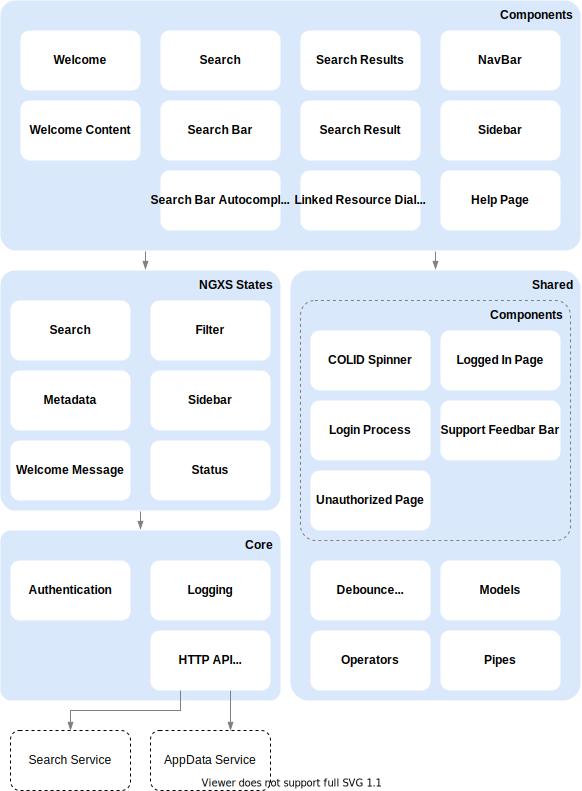

# COLID Data Marketplace
The COLID Data Marketplace allows the user to make the resources registered in the editor searchable with a full text search. In addition to the full-text search, the Data Marketplace also allows you to filter the resources according to individual attributes.

## Technology Stack

1. Angular 8
1. NGINX web server
1. Docker image for deployment

### Special libraries

- [Active Directory Authentication Library (ADAL) for JavaScript](https://www.npmjs.com/package/adal-angular)
- [Bootstrap](https://getbootstrap.com/)
- [ngx-bootstrap](https://valor-software.com/ngx-bootstrap/#/)
- [ngx-infinite-scroll](https://github.com/orizens/ngx-infinite-scroll)
- [NGXS](https://www.ngxs.io/)

## Application Architecture

## Communication

- Calls REST-API of Search Service to retrieve search results
- Calls REST-API of AppData Service to save default filters, subscriptions and stored queries
