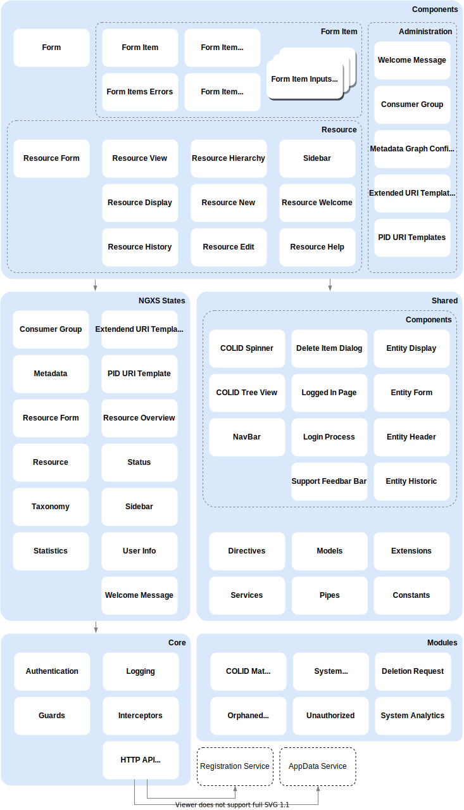

# COLID Editor
External resources can be registered in the COLID Editor and enriched with predefined metadata. The entries in the COLID Editor are called "COLID entries".
Among other metadata fields, the so-called PID URI (Permanent Identifier URI) is one of the most important. Each resource is assigned to one from the Registration Service, which is permanently retained throughout the life cycle of the resource. In addition, the actual resources, enriched with metadata in COLID, are linked via so-called Target URIs. These are entered manually by the user. The COLID Editor communicates with the Registration Service for resource registration.

## Technology Stack

1. Angular 8
1. NGINX web server
1. Docker image for deployment

### Special libraries

- [Active Directory Authentication Library (ADAL) for JavaScript](https://www.npmjs.com/package/adal-angular)
- [Bootstrap](https://getbootstrap.com/)
- [ngx-bootstrap](https://valor-software.com/ngx-bootstrap/#/)
- [ngx-infinite-scroll](https://github.com/orizens/ngx-infinite-scroll)
- [NGXS](https://www.ngxs.io/)

## Application Architecture

## Communication

- Calls REST-API of [Registration Service](registration-service.md) to create/edit/delete COLID entries, consumer groups, and other entities
- Calls REST-API of  [AppData Service](appdata-service.md) to set default consumer group and subscriptions
