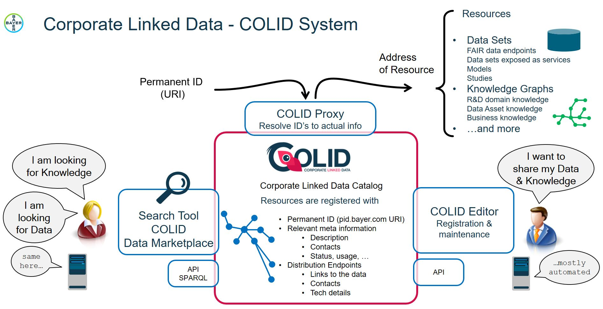
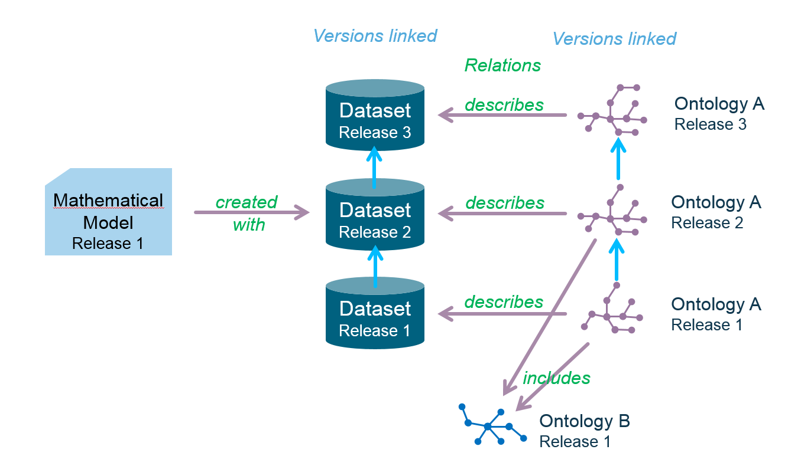

# Functional Specification

[//]: # (1)
## Purpose of this document
This document provides a high-level description of the functions of the Corporate Linked Data Catalog COLID.
Information about the role needed to execute a function is included.

[//]: # (2)
## Target audience
Product managers, project managers, software architects, and developers.

[//]: # (3)
## COLID Application
Corporate Linked Data - short: COLID - is a technical solution for corporate environments that provides a metadata repository for corporate assets based upon semantic models.
COLID assigns URIs as persistent and global unique identifiers to any resource.
The incorporated network proxy ensures that these URIs are resolvable and can be used to directly access those assets.
By following the Linked Data principles consequently, the data model of COLID uses RDF and provides the content through a SPARQL endpoint to consumers.
This model was developed based on learnings from open standards like dcat and prov-o.
Being both a management system for resolvable identifier and an asset catalog, COLID is the core service to realize Linked Data in corporate environments and therefore an essential cornerstone for FAIR data.

Resources get registered with a basic set of descriptive metadata plus additional metadata, which get more specific for various resource types.
They can have one or multiple Distribution Endpoints of different types, which contain clickable links where users can directly access the resource or obtain further information about it, and additional metadata.
Resources are often in specific relations to other resources.
In COLID such relations are defined in the underlying semantic model and can be explicitly assigned as links between resources. 

[//]: # (3.1)
###	COLID Components
The system essentially consists of multiple microservices which communicate with each other via HTTP/REST.
It was developed to run in a Kubernetes cluster as containers, which enables scalability and high workloads.
In general the container platform allows to run the cluster in different clouds, though the application was developed and tested in the AWS Cloud, so others may not be fully supported.

COLID itself consists of core components which are described below.
Each of these contains more components which cover the whole application feature set.

You can find more details to each of these services in the technical documentation.

[//]: # (3.1.1)
#### Backend (Registration Service, Indexing Crawler Service, Search Service, Reporting Service, AppDataService, Scheduler Service) 
Core of the application is the Registration Service, which offers basic CRUD-operations to interact with the graph database.
Verification functions ensure that only valid data is stored and made visible.

The search service is the communication endpoint for the Data Marketplace.
It fetches information from an Elasticsearch engine to show all resources quickly.

The Reporting Service delivers data statistics, AppDataService is for user-related content and preferences, and the SchedulerService for batch jobs.

Main datastore is a graph database.
A relational database is used for user settings. The main functionalities of the COLID application are provided by the COLID backend.
It is built upon a REST API with a collection of core services.
Through its core services the API enables machine users to interact with the backend and utilize its functions.

URI management is also being realized in the COLID backend, while the resolution of URIs to actual resource addresses is being managed by a stand-alone proxy server.

[//]: # (3.1.2)
#### Frontend (Editor, Data Marketplace):
There are two frontends (webclients) made for different user personas.
Both frontends communicate with different services by their API directly.
The purpose of the editor frontend is to register and edit new resources, distribution endpoints, etc. and communicates mainly with the registration service.

The Data Marketplace is for data consumers and interacts mainly with the search service, to gather information / data.
All the data found is read only and can’t be edited within this frontend.

[//]: # (3.1.3)
#### Proxy
Routes permanent IDs to actual information.
Each resource, registered in COLID contains a PID URI, which leads directly to the catalog entry.
The management of URI linking is implemented using a separate NGINX proxy.

[//]: # (3.2)
###	COLID Authorization Concept
The catalog system utilizes Azure AD for user authentication.
User roles are pre-defined in Azure AD. Machine users and human users have different roles:

Each role is assigned access to functions in a layered manner, so the top-level role inherits the functionalities of the lower-level roles:
* Reader (view COLID entries) 
* Editor (register, edit and view COLID entries for specific consumer groups)
* Admin (consumer group, deletion requests, PID URI templates and extended URI templates management)
* Super Admin (metadata graph configuration, orphaned identifiers management)

Machine users have the same rights as the Editor role for human users with one exception – they can additionally edit resources for all consumer groups.
Super Admin and Admin are exclusive roles for human users of the COLID Editor.

[//]: # (3.3)
###	COLID Linking Concept
Resources in COLID can be linked to other resources, using semantically defined relations.
Links are by their RDF nature directed, maintained in the originating resource entry and specific to the originator's and the target's resource type. 

A special case of this functionality are resources that exist in multiple distinct versions.
These can be registered in COLID separately but linked up with version links.
It is only for version linked resources that multiple resources can have the same Base URI assigned.

[//]: # (4)
## COLID Backend

[//]: # (4.1)
###	Registration Service
The registration service is the core component of the COLID application.
It provides all functions to create, edit, publish and delete entries.
The registration service is structured in different sub-services.
Each sub-service provides a specific, technically separated functionality.

[//]: # (4.1.1)
#### Resource Management Service

[//]: # (4.1.1.1)
##### Overview
The functionalities for managing resources, registered in COLID’s data catalog, are:
* View an entry (all roles)
* Create a new entry (editor)
* Edit an entry (editor)
* Save an entry as draft (editor)
* Publish a draft entry (editor)
* Mark/unmark an entry for deletion (editor)
* Delete an entry (is applicable only for entries which are marked for deletion, editor permissions for draft entries, admin and super admin permissions for published entries)
* Link/unlink an entry with another (editor)
* View linked versions of a resource (all roles)
* History view for a given version of an entry (all roles)

[//]: # (4.1.1.2)
##### Resource types
When creating a new entry in the catalog, users have to select one of the pre-definede types of resources.
For each resource type there is a dedicated set of metadata that can be captured.
The resource types as well as the metadata set for a specific resource type are defined through a collection of specialized ontologies.

[//]: # (4.1.1.3)
##### Metadata about a resource
COLID offers the following set of field types for capturing metadata:
* Check boxes
* Single select dropdown lists (managed by controlled vocabularies)
* Multi select dropdown lists (managed by controlled vocabularies. Provides instance search with auto complete)
* Multi select dropdown list with hierarchy (managed by taxonomy)
* Selection lists (managed by controlled vocabularies)
* URI fields (free text with prefix or generated by PID URI template)
* HTML fields (with HTML editor in the UI)
* Text fields (free text)
* Date fields (formatted datetime, in the UI users see a required format template and can use a date picker)
* Numeric fields (free text)
* Person (using email as identifier, search for persons and groups via email, name, via Microsoft Graph in Azure AD, provides auto complete, but in the open source version only sample users have been provided)

Depending on the use case, the metadata fields are augmented with extended functionalities and constraints such as:
* Custom keywords
* Constraints (regex, SHACL)
* Mandatory and non-mandatory fields
* Single/multiple entries for a given property
* Content can only be selected from controlled vocabularies

**Controlled vocabularies**
Controlled vocabularies restrict users to pre-defined sets of property values.
They may be defined in separate reference datasets, hierarchical taxonomies, or as instances to classes in COLID’s metadata ontologies. 

[//]: # (4.1.1.4)
##### Registration status
The system uses different states for registered COLID entries that indicate the lifecycle:

* Draft: A preliminary version of an entry. In this state, users can saved an entry even if the data validation still returns errors. All the URIs used in this entry become permanent and cannot be changed any more. Drafts can be deleted by an editor.
* Published: An entry, that meets all criteria for a valid entry. Editing a published entry leads to the creation of a new draft based on the current published one.  
* Marked for deletion: A published entry that is no longer required. Editors can only mark for deletion, an Admin needs to delete.
* Historic: When a published entry is edited and the new draft revision gets published, the previous published content gains the status historic. Historic entries can be shown but not be changed any more.

**Linking of resources**
* Linking a resource to another, related, resource. The link type must match the originating resource type and the type of the resource that is to be linked with it.
* Unlink two resources

**History View**
* The history view is an audit trail functionality of published COLID entries that allows users to view the current draft and/or published entry and all past published revisions of an entry, as an overview list. 
* Historic entries can be shown by identifiers obtained with the list. 

[//]: # (4.1.2)
#### Metadata Management Service
The entire application is based on metadata, which are maintained by ontologies hosted in a triplestore. In these metadata individual resource types and their properties are defined. The metadata service provides functions to query these data.

* Retrieving the hierarchy of all resource types with their labels, descriptions, and identifiers.
* Retrieving a list of the metadata properties for a given resource type as key/identifier with all semantic properties and constraints.

[//]: # (4.1.3)
#### Identifier Management Service
PID URIs are globally unique identifiers that are assigned to a resource and its COLID entry, for each of its distribution endpoints, and also for its base URI in case the resource is an RDF resource. 

Within the COLID user community, different consumer groups have different requirements to the formatting of URIs.
To ensure general consistency COLID uses templates for the forming of URIs. More information on this is in the next chapter.

Editors in a consumer group, or API users, can choose one of the assigned templates or not use a template and enter an individual URI themselves, which still must include the mandatory start term and must be unique.

Base URIs offer the additional option to enter individual URIs without the mandatory start term, in order to allow registering external ontologies and other knowledge graphs with namespaces outside of the corporation.

PID URIs are managed by the identifier management service. Functions are:
* Generate Identifiers using a pre-defined template 
* Check for duplicates
* Determine orphaned identifiers and return them in a list (Super Admin)
* Deletion of orphaned identifiers (Super Admin)

All COLID entries get a unique PID URI within the registration process.
The application ensures the uniqueness of PID URIs by a duplicate check function every time when an identifier is initially saved with a new resource.
This is important especially when users use custom URIs.

COLID links each URI to the URI template used for its creation.
That information is used for backend validation and in other ways, e.g. in the Editor UI users will only have to pick a template once for a new resource entry and it will be proposed for all Distribution Endpoint URIs of that same resource.

Orphaned identifiers are PID URIs that were already in use for entries that have since been deleted.
COLID continues to store the URIs to prevent re-use for anything other than the original resource.
For the management of these identifiers COLID offers a functionality, which determines all current orphaned identifiers and returns them into a list.

In case there is a good reason to revive a URI, a Super Admin can access the orphaned identifiers list and delete such PID URIs.
Once an orphaned PID URI is deleted it can be used again for the registration of a new entry.

[//]: # (4.1.4)
#### URI template management service 
PID URI templates define how URIs are formed.
They consist of a mandatory start term, an individual middle term, the actual variable identifier as a parametrized number or GUID, and an optional end character “/”.
They are managed centrally in the application by Admin or Super Admin users and can be individually assigned for use to consumer groups. 
The PID URI template service and its functionalities are:
* Return the list with all PID URI templates
* Return the PID URI template of the given ID
* Create a new template
* Edit a template 
* Deactivate a template (if it is still in use by identifiers of the COLID entries)
* Reactivate a template
* Delete a template (is possible, if the template is not in use by any identifier of the COLID entries)

[//]: # (4.1.5)
#### Resource version management service
Many resources are available in dedicated and individually released versions, which stay separately available.
These are registered in the catalog as separate entries that each represent an individual version of the resource.
To make their relation explicit, they are linked with each other.
COLID will use the version information to line versions up in the correct order.
To make or break version links, and to allow for an easy creation of a new resource version entry from an existing one, COLID offers these functions:
* Link COLID entries together as versions
* Create a new COLID entry based on an existing entry and link it as a new version of the existing entry

[//]: # (4.1.6)
#### Extended URI template management service
This service allows to control the behavior of forwarding PID URIs to specific target systems with target URIs.
The PID URI forwarding can be configured with Extended URI templates.
In such a template the user can define how the new destination address, to which a request will be forwarded, should look like.

The service provides high flexibility to meet the needed requirements for URI forwarding to the different target systems.
Therefore regular expressions are used to match a specified format of PID and target URIs and to construct the forwarding URI to specific target systems.

The functionalities of the extended URI template service are:
* Return the list with all Extended URI Templates available
* Return the Extended Template of the given ID
* Create an Extended URI Template
* Edit an Extended URI Template
* Delete an Extended URI Template

[//]: # (4.1.7)
#### Distribution Endpoint management service
Each COLID entry can have one or more distribution endpoints.
A distribution endpoint points to the place where the described data can be found or where additional information about the described data could be found. Distribution endpoints incorporate the destination addresses of the external resources.
Therefore several distribution endpoints of different types can be created.

The Distribution Endpoint functions are:
* Create Distribution Endpoint and append it to the resource of a given PID URI
* Edit a Distribution Endpoint
* Delete a Distribution Endpoint

[//]: # (4.1.8)
#### Consumer groups management service
A consumer group is a specific group of users, typically representing business units.
All COLID entries are assigned to a consumer group.
COLID Editors can only create or edit COLID entries for their assigned consumer group(s) however they can view all entries from other consumer groups.

The consumer groups management service has the following functionalities:
* Return a list of all consumer groups (Admin)
* Return a list of all active consumer groups (Editor)
* Return the consumer group of a given ID (Editor)
* Create a consumer group (Admin)
* Edit a consumer group (Admin)
* Delete a consumer group (Admin)
* Reactivate a consumer group (Admin)

[//]: # (4.1.9)
#### Keyword management service
To each COLID entry keywords can be assigned. Those keywords are shown as possible filters in Data Marketplace.
This functionality allows to tag entries with keywords and this additional information can be used to make it findable.
Editors can use keywords already created by other editors. In addition, editors can create keywords accessible by other editors.

The main functions of the keyword management service are:
* Return a list of keywords (Editor)
* Return the keyword of an ID (Editor)
* Create a keyword (Editor)
* Delete a keyword (Editor)

[//]: # (4.1.10)
#### Statistics management service 
With the statistics management service users can access several pre-defined live usage statistics regarding COLID entries.
The statistics service functions are:
* Return the number of resources (Editor)
* Return the number of selected possibilities of one property for controlled vocabulary selection (Editor)
* Return the usage frequency of a property (Editor)
* Return the number of resources in relation to property width (Editor)
* Return the number of versions of a COLID entry (Editor)
* Return the number of property usage of group properties (Editor)

[//]: # (4.2)
### Additional API services and functions
Next to the registration service and its sub-services described in chapter [COLID Component](https://colid.pages.gitlab.bayer.com/docs/tech/#/functional-specification?id=colid-components), the application provides a set of additional services and functions.

[//]: # (4.2.1)
#### Validation service and functions
This service validates all the metadata captured for a resource before it is stored.
It assures that the captured data such as consumer groups, PID URI Templates and Extended URI Templates match the definition of the metadata against SHACL constraints.
Only Super Admins can manage these constraints through the metadata configuration.

[//]: # (4.2.2)
#### User data management service
The main functionality of the user data management service is to store different configurations for human users regarding the Editor and Data Marketplace frontend applications.
The following types of user data are stored in a separate RDBMS:
* User configuration data
* Default consumer group for the COLID Editor
* Default search filter for Data Marketplace
* Welcome messages
* COLID entry subscriptions (upcoming new functionality)
* User stored queries for subscriptions (upcoming new functionality)

[//]: # (4.2.3)
#### Maintenance management service 
This service allows setting the COLID application into maintenance mode for conducting maintenance activities (e.g. deployment of a new release).
The maintenance mode has the following functions:
* COLID data becomes read only
* Users are restricted and cannot edit, save or register a COLID entry
* Users can only view COLID entries

[//]: # (4.3)
### Graph Database
The graph database of COLID is responsible for the data storage of the primary COLID entries.
It enables to store independent COLID entries that can be linked to each other using individual triples.
Data is managed in the database as triples and RDF graphs (see also https://www.w3.org/TR/rdf11-concepts/#section-generalized-rdf).
An RDF Graph, also called a Named Graph, is a series of triples.
Within COLID these graphs are used to organize triples that are separated by their domains.
For example, entries of COLID, metadata, and shacls as other instances are grouped separately in different graphs.

The data authority within the application belongs to the Registration Service.
So only the registration service should be allowed to make changes to the data in the triplestore.
Background are further processes, like indexing of entries (see chapter [Indexing Crawler Service](https://colid.pages.gitlab.bayer.com/docs/tech/#/functional-specification?id=indexing-crawler-service)), which are essential for the proper working of the application.
The communication between the service and the database is based on the Sparql 1.1 standard.

[//]: # (4.4)
### Search service and Elasticsearch
The Search service as well as Elasticsearch are a separate deployment unit.
They enable full text search across the entries registered in COLID.
Only published entries, specifically all entries that have published the status and are marked for deletion, are written into the index of Elastic by an indexing process.

The Indexing Crawler Service is the connection between the data in the triplestore and the data in Searchservice/Elastic and makes sure that all relevant data is available for indexing (see chapter [Resource Management Service](https://colid.pages.gitlab.bayer.com/docs/tech/#/functional-specification?id=resource-management-service))
The functionality of the search service is based on the ability of COLID entries, their linked entries, as well as the linked endpoints.
Elasticsearch uses techniques of natural language processing und information retrieval to provide a holistic full-text search to the users.
In elastic data is organized by indices and their configuration.
The search service creates new indices based on the metadata, configures them and builds or modifies users' searches based on this metadata.
This leads to another functionality, the generic configuration of the search by metadata.

Elasticsearch uses techniques of natural language processing und information retrieval to provide a holistic full-text search to the users.

[//]: # (4.4.1)
#### Search request
In the search request to the Search Service users can define:
* The search term he is looking for. It can be a part of a word, a complete word or a phrase.
* With ‘aggregation filters’ the user can filter the search results to provide aggregated data on a search query.
* With ‘range filters’ the user can filter the search results on a time axis. The user can define ‘from’ and ‘to’ dates, and the property must be within the given range.

[//]: # (4.4.2)
#### Building the search query
Based on the search request the Search Service builds a complex search query and sends it for execution to Elasticsearch.
The logic to build the search query includes the following functions beside the full-text search and filtering:
* Search in linked resources
* Synonyms search for taxonomies. The system supports hierarchical taxonomies for controlled vocabularies, e.g. for the classification of catalog entries. Taxonomies are stored in elastic as synonyms, so that the user has the possibility to search for superordinate terms.
* Bucket aggregations to display the number of resources that match a filter.
* Add search result highlighting.

[//]: # (4.4.3)
#### Search results
After the search was successfully executed on Elasticsearch the search results will be returned.
This response contains:
* A list of search results matching the query.
* The list is sorted by relevancy score, as provided by Elastic.
* The list returns all values/properties for the COLID entries.
* A search result highlighting is returned, so users can identify matches in the result text.

[//]: # (4.5)
### Indexing Crawler Service
The Indexing Crawler Service (ICS) together with the Search Service is responsible for indexing COLID entries in the Elasticsearch search engine.
It ensures that all entries in COLID, including their links, are always updated and indexed in Elasticsearch.

When a COLID entry is added or updated by the Registration Service, the ICS is informed.
The ICS pulls the data of the entries out of the triple store, performs some data transformations and sends it to the Search Service for indexing. 

[//]: # (5)
## Frontend
This chapter provides details about the frontend applications that allows human users, data providers, data consumers, and administrators, to interact with the catalog.

[//]: # (5.1)
### COLID Editor
The COLID Editor is a web client where all users can review resource entries and their previous revisions, and editors register and maintain resources in COLID. The editor communicates with the Registration Service for resource registration. It also provides a UI for application administration functions.

[//]: # (5.1.1)
#### Base functionalities
The following base functionalities are available to all user groups:
* Simplified search
    * Text search across limited fields like title, definition, permanent Identifier
    * Filter resources based on different fields like entry lifecycle status, Consumer Group, last changed user, author, as well PID Uri and Base Uri
* Panel to show all possible resource types in COLID to register them
* Form to register, link and manage entries with distribution endpoints. 
* Create new versions from existing entries
* Analysis and statistics about registered resources in COLID

[//]: # (5.1.2)
#### Admin and Superadmin specific functionalities
In addition to the base functionalities, the admin role offers the following functions:
* Consumer groups management (create, edit, delete, activate, deactivate)
* PID URI templates management (create, edit, delete, activate, deactivate)
* Extended URI templates management (create, edit, delete) 
* Deletion requests (reject the deletion request or delete COLID entries)

In order to handle PID URI forwarding more generically, the Extended URI Templates can be used to create regex-based rules that are processed by the NGINX proxy server.
The super admin role includes the following functions:
* Metadata graph configuration
* Orphaned identifiers management (view and delete orphaned PID URIs)

[//]: # (5.1.2.1)
##### Metadata graph configuration service functionalities
With the metadata graph configuration, Super Admins can integrate and manage reference datasets, taxonomies and ontologies, which together define the data and metadata structure of the catalog data created with the application, and the available instances where controlled vocabularies are used.
For specific functions and use cases (consumer groups, keywords, metadata etc.) there are dedicated RDF graphs that a Super Admin can integrate into the COLID application.

Metadata graph configurations are fully versioned, which allows tracking of changes and assures that historic content of the catalog can always be reconstructed with the metadata definition that was valid at a given time.

Here is an overview of the metadata graph configuration functions:
* Create new metadata graph configuration and set the currently active version as a historic version
* Return the active metadata graph configuration
* Overview of all historic versions of the metadata graph configuration and their start date
* Re-index metadata graph configuration feature to adjust the search in the Data Marketplace to the current metadata configuration

With the re-index feature, Super Admins can initialize a re-indexing process for the Elasticsearch index in order to renew the search and adapt it to the current configuration. The re-indexing process includes the following steps:
* Create an Elasticsearch mapping from the current metadata configuration
* Based on the current metadata graph configuration, a new index of all  (published) catalog content is created, that replaces the previous index. 

[//]: # (5.2)
### Data Marketplace
The COLID Data Marketplace is the frontend component for the search service, where users can full text search for registered and published resources and efficiently filter results using the aggregations.
Hits are shown on a catalog entry level.

[//]: # (5.2.1)
#### Search and filter
The Data Marketplace is a web client where users can easily search for entries in the catalog.
A full text search with various filter options is provided.
In addition to the content of the entries, the content of the distribution endpoints as well as the linked entries are considered. 
* Search with Elasticsearch Query DSL (Domain Specific Language). This query DSL allows to use wildcard and regex expressions within a search query. 
* Autocomplete / type ahead search function to provide the user with search term suggestions based on his input.
* (Upcoming feature) Stored queries to inform users about changes in the search results for specific query. 
* The use of taxonomies as search criteria. Synonyms for nodes are used to find derived terms.

[//]: # (5.2.2)
#### Search Results
After defining and executing the search, users want to evaluate the results, apply further filters to them, or explore the data.
These functions are available:
* Display a list list of all the search results. Initially only one page with results are listed, with more being loaded when scrolling down. Documents shown minimized to a maximum area, with the option to expand all metadata text and then the complete data of the catalog entry:
    * Distribution Endpoints
    * Linked entries which are directed to the entry as well as outgoing from the entry to another. Linked entries are completely integrated into the search. But the user only receives dedicated information about a linked entry.
* Opening a linked entry in an additional dialog to get more information.
* Search result highlighting to show the user where the query matches. 
* Display the number of available search results for each filter on the left. Each filter criteria contains a number that determines how many entries can be found for that criteria based on the current search.
* Support the users with did you mean search suggestions. This functionality correct the user's spelling after they have searched and provides this proposal.

[//]: # (6)
## COLID proxy server
One of the fundamental concepts in COLID is that every entry in the catalog has a unique identifier.
All identifiers are resolvable by the COLID proxy server.
A script updates the server every minutes by requesting the current configuration from the Registration Service.
If the configuration is valid, it is taken over into Nginx.

The proxy server is configured with following forwarding rules:
* The PID URI of a COLID entry is always forwarded to the entry itself. 
* The PID URI of a distribution endpoint is forwarded to the target URL of the endpoint.
* The Base URI is forwarded to a specified (main) distribution endpoint of the entry. If there are linked version entries of the same resource, with conflicting main distribution endpoint settings, the configuration of the latest version is used. If there is no main endpoint, the Base Uri is forwarded to the PID URI of the entry.

Extended URI templates extend the rules of forwarding for PID URIs as well as Base URIs to Target Urls of resources, so that COLID can resolve URIs to instances inside of registered resources.
They are a set of rules that allow COLID to identify URIs that are longer than the registered identifiers, identify the system where the resource is hosted, and apply rules how the unknown 'extension' needs to be attached to the known target address so that the target system can understand it and resolve it to the requested instance, not only to the resource. 
