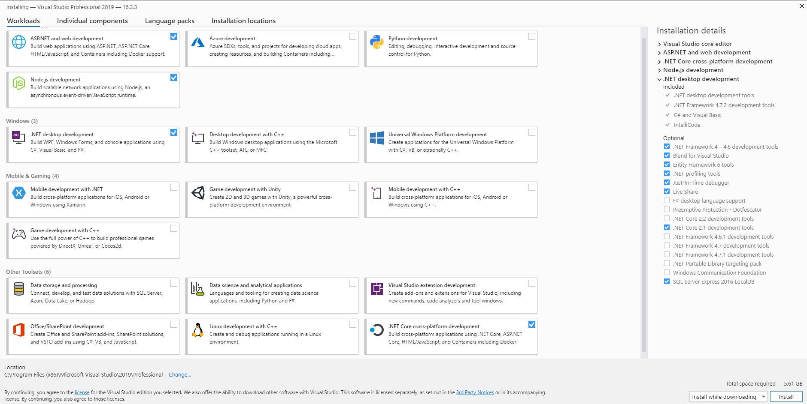

# How to contribute

The following document describes how the application can be installed, run and developed on the local computer. This documentation describes the setup for a developer.

## Download & Installation Software

In order to run and develop the application on the local computer, some installations are necessary. The following files have to be downloaded. Since the system configurations can be different from user to user, the specification of the respective system must be observed when downloading the files. Other editors can also be used for development, but these are not considered in this documentation.

 - [Visual Studio 2019](https://visualstudio.microsoft.com/vs/)
 - [Visual Studio Code](https://code.visualstudio.com/)
 - [NodeJS](https://nodejs.org/en/)
 - [.NET Core 3.1 SDK](https://dotnet.microsoft.com/download)
 - [SourceTree](https://www.sourcetreeapp.com/) (Recommend)

While all other installations can be installed as suggested, the following things must be considered when installing Visual Studio:



## Repository 

All repositories of the software are available at [GitHub](https://github.com/Bayer-Group/). 

## Node/NPM

In order to start developing the frontend applications, Node must be installed and additional packages must be downloaded by NPM. 

First you have to check in the command line if node is installed:

``` console
foo@bar:~$ node -v
v13.11.0
```

If an version is displayed, the angular cli must be installed using npm. npm is installed as part of NodeJS.

``` console
foo@bar:~$ npm install -g angular-cli
```

To check if the cli has been installed correctly, this can be checked by the following command.

``` console
foo@bar:~$ ng version
[...]
Angular CLI: 9.0.7
Node: 13.11.0
OS: win32 x64
```

# Build & configure the local setup

In order to start the application locally, first clone the necessary repositories from the GitLab project as stated in the [Quick start guide](/quickstart). The following are two examples for setting up the applications, one for a frontend project and one for a web service project.

## Frontend, e.g. COLID Editor

Since every application based on Angular has dependencies to other packages, especially Angulars own packages, these must be installed before the first start of the application. For more information, please check the [Angular documentation](https://angular.io/guide/npm-packages).

In the project folder `~\colid-frontend\colid-frontend` containing package.json execute the following command to install all dependencies:

``` console
foo@bar:~\colid-frontend\colid-frontend$ npm install
```

To start the frontend, the command `ng serve` must be executed in the ` ~ \colid-frontend\colid-frontend` directory:

``` console
foo@bar:~\colid-frontend\colid-frontend$ ng serve

Date: 1970-01-01T01:00:00.000Z
Hash: de78df7801c161b00c17
Time: 80651ms
chunk {main} main.js, main.js.map (main) 4.91 MB [initial] [rendered]
chunk {polyfills} polyfills.js, polyfills.js.map (polyfills) 667 kB [initial] [rendered]
chunk {polyfills-es5} polyfills-es5.js, polyfills-es5.js.map (polyfills-es5) 462 kB [initial] [rendered]
chunk {runtime} runtime.js, runtime.js.map (runtime) 6.08 kB [entry] [rendered]
chunk {scripts} scripts.js, scripts.js.map (scripts) 697 kB [entry] [rendered]
chunk {styles} styles.js, styles.js.map (styles) 1.39 MB [initial] [rendered]
chunk {vendor} vendor.js, vendor.js.map (vendor) 12 MB [initial] [rendered]
** Angular Live Development Server is listening on localhost:4201, open your browser on http://localhost:4201/**
i ｢wdm｣: Compiled successfully.
```

If the result is `Compiled successfully`, the frontend was built successfully and is available under the path `http://localhost:4201`.

## Web service, e.g. Registration Service

If Visual Studio is installed, the solution file COLID.RegistrationService.sln can be opened in the cloned repository of the service. During the first opening of the solution, some dependencies are automatically loaded by NuGet. This may take a moment.

To start the local web service, select the "Local" setting in the upper part of Visual Studio. By clicking on the play icon the web services starts and swagger page should open in your browser.
