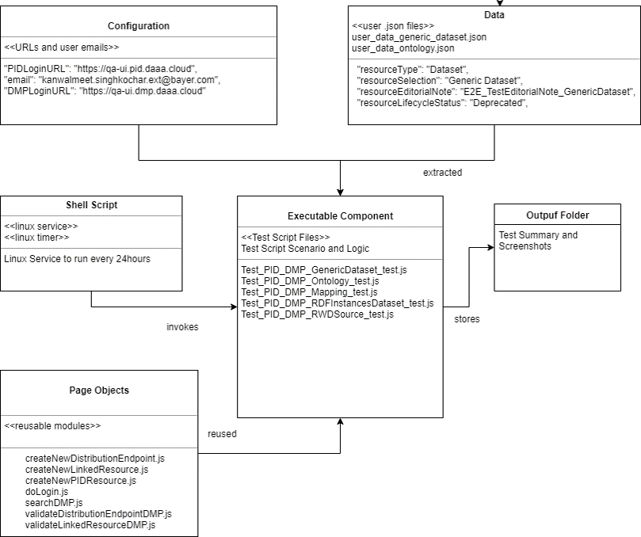
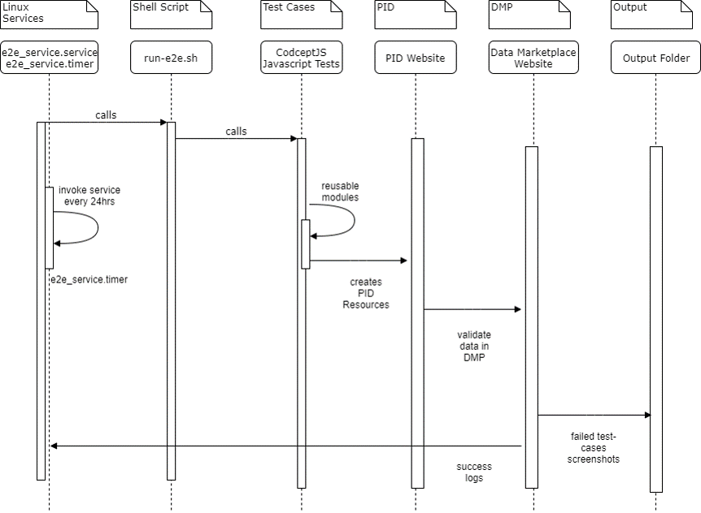

# Testing

The application is tested in four stages.
1. The lowest layer consists of unit tests of individual modules and classes.
1. Building on this, integration tests test the integration between an individual Web service, its lowest repository classes, and the respective database.
1. Functional tests map the tests of an individual web service and thus test the entire APIs of the individual web services through their layers.
1. Finally, the end to end tests cover the integration of all web services and the frontend applications and thus test the interaction between them.


The amount of tests should be distributed like in the shown pyramid below.


The first three test levels are stored within the web services in the test folder and are supported by the following two test frameworks:
- XUnit
- Moq

Since an active database connection must be available for the integration and function tests, the necessary database is set up as In-Memory/SQLite before starting a single test class, set up and filled with the appropriate data.The use of SQLite can lead to different problems in cases of migrations and/or foreign keys, which is both not supported.

 In addition, the cache will be ignored and NoCacheService used, which tunnels the expression 1:1 and does nothing else.

Besides that "never test 3rd party components" should be considered, during the test writing.

## Unit testing

In comparison to the other two types of tests, unit tests refer exclusively to the testing of the smallest single unit. All call to other injected components, services, repositories should be mocked, so that every single unit can be tested. The units can be tested for all services, extensions, guards, etc. but not controllers or database frameworks as mentioned in the previous section.

## Integration testing (Repositories)

Integration tests refer exclusively to the testing of repositories that use the EFCore DatabaseContext or the COLID TripleStore. The responding databse-content, will be mocked and the actual repository behaviour should be tested.

## Functional testing (API's)

This type of testing focuses on testing the API endpoints using an Http client. Functions within the application must NOT be called here. The backend will be tested completely with a simulated database instance (like SQLite or an in-memory graph) from controller down to repository. All steps will be included there and the end result should be as expected. Because of the 3 layer testing (controller, service, repo), these kinds of tests require the most time to write and minor errors could be hidden by the middleware or similar.s

## E2E Tests

The purpose of performing end-to-end testing is to identify system dependencies between the COLID Editor and Data Marketplace and to ensure that the data integrity is maintained between the various components of the COLID system.

A Linux service is setup which will automatically invoke the test scripts once every 24 hours and send alerts to the team in case of success and failures.

### Testing Tool

For E2E testing, the framework CodeceptJS is used, a modern JavaScript-based end-to-end test framework.
Test scenarios are written as a linear sequence of user actions on a web page.
CodeceptJS uses various helpers to execute test scripts. For this project, we used the Puppeteer helper, which can also be used to execute Chrome headless.
The following is an example of how an E2E test is structured in CodeceptJS:
```js
Feature('My First Test');
Scenario('test something', (I) => {
    I.amOnPage('http://localhost:51770/');
    I.see('Editor');
});
```

The result of this test would look like:
```console
My First Test --
  test something
     I am on page "http://localhost:51770/"
     I see "Editor"
✓ OK
```

### Components Overview

A shell script repeats the E2E tests every 24 hours. An executable test component is based on individual subpages that can be reused by the different tests. Using configuration and input data, different scenarios can be modularly mapped. After the test execution, the results are finally stored in an output folder.



### Process Overview



### References

All further details regarding the End to End Tests can be found at the below link.
Read more [here](assets/testing/PID_DMP_E2E_1.1.pptx)